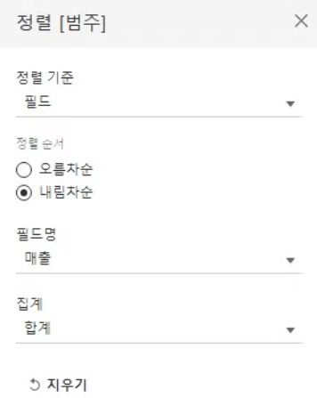
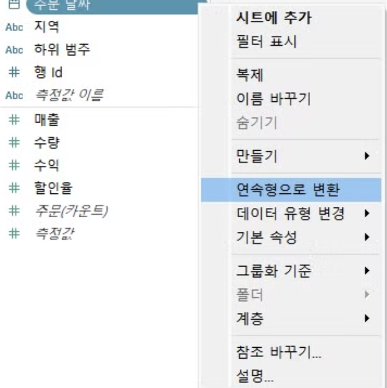
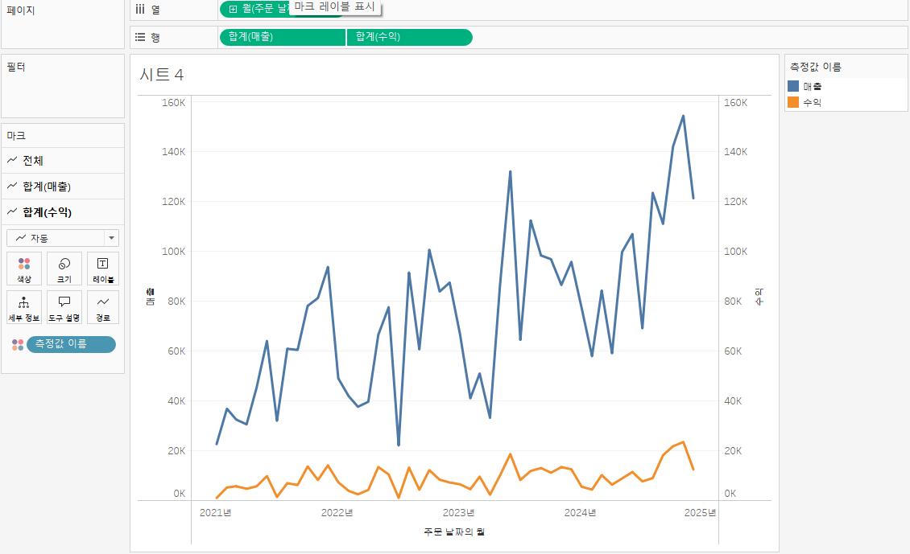
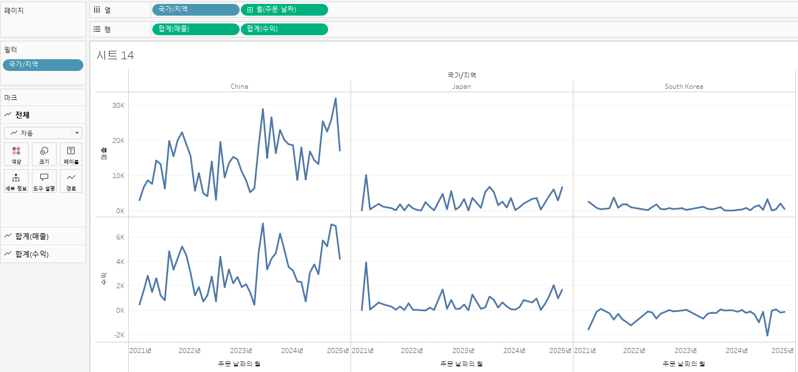

# Second Study Week

- 10강: [차원과 측정값](#10강-차원과-측정값)

- 11강: [시각화](#11강-시각화)

- 12강: [막대그래프](#12강-막대그래프)

- 13강: [누적막대그래프](#13강-누적막대그래프)

- 14강: [병렬막대그래프](#14강-병렬막대그래프)

- 15강: [누적병렬막대그래프](#15강-누적병렬막대그래프)

- 16강: [라인그래프](#16강-라인그래프)

- 17강: [맵작성](#17강-맵작성)

- 18강: [텍스트테이블](#18강-텍스트테이블)

- 19강: [트리맵과 하이라이트테이블](#19강-트리맵과-하이라이트테이블)

- 문제1 : [문제1](#문제1)

- 문제2 : [문제2](#문제2)

- 참고자료 : [참고자료](#참고-자료)


## Study Schedule

| 강의 범위     | 강의 이수 여부 | 링크                                                                                                        |
|--------------|---------|-----------------------------------------------------------------------------------------------------------|
| 1~9강        |  ✅      | [링크](https://youtu.be/3ovkUe-TP1w?si=CRjj99Qm300unSWt)       |
| 10~19강      | ✅      | [링크](https://www.youtube.com/watch?v=AXkaUrJs-Ko&list=PL87tgIIryGsa5vdz6MsaOEF8PK-YqK3fz&index=75)       |
| 20~29강      | 🍽️      | [링크](https://www.youtube.com/watch?v=AXkaUrJs-Ko&list=PL87tgIIryGsa5vdz6MsaOEF8PK-YqK3fz&index=65)       |
| 30~39강      | 🍽️      | [링크](https://www.youtube.com/watch?v=e6J0Ljd6h44&list=PL87tgIIryGsa5vdz6MsaOEF8PK-YqK3fz&index=55)       |
| 40~49강      | 🍽️      | [링크](https://www.youtube.com/watch?v=AXkaUrJs-Ko&list=PL87tgIIryGsa5vdz6MsaOEF8PK-YqK3fz&index=45)       |
| 50~59강      | 🍽️      | [링크](https://www.youtube.com/watch?v=AXkaUrJs-Ko&list=PL87tgIIryGsa5vdz6MsaOEF8PK-YqK3fz&index=35)       |
| 60~69강      | 🍽️      | [링크](https://www.youtube.com/watch?v=AXkaUrJs-Ko&list=PL87tgIIryGsa5vdz6MsaOEF8PK-YqK3fz&index=25)       |
| 70~79강      | 🍽️      | [링크](https://www.youtube.com/watch?v=AXkaUrJs-Ko&list=PL87tgIIryGsa5vdz6MsaOEF8PK-YqK3fz&index=15)       |
| 80~89강      | 🍽️      | [링크](https://www.youtube.com/watch?v=AXkaUrJs-Ko&list=PL87tgIIryGsa5vdz6MsaOEF8PK-YqK3fz&index=5)        |


<!-- 여기까진 그대로 둬 주세요-->
<!-- 이 안에 들어오는 텍스트는 주석입니다. -->

# Second Study Week

## 10강: 차원과 측정값

<!-- 차원과 측정값에 관해 배우게 된 점을 적어주세요 -->


선 기준 위는 차원, 아래는 측정값


- 연속형=초록색, 불연속형=파란색
- 마우스 우클릭 또는 역삼각형 클릭으로 차원/측정값 변환 가능

> **🧞‍♀️ 차원과 측정값의 고유한 특성에 대해 설명해주세요.**

```
- 차원: 정성적인 값, 불연속형 필드
- 측정값: 정량적인 값(수치), 연속형 필드
```

*Quiz: 차원은 불연속형이고, 측정값은 연속형이다 (**O**)*


## 11강: 시각화

<!-- 시각화 관해 배우게 된 점을 적어주세요 -->
- 더블클릭 또는 드래그 앤 드랍으로 열과 행 설정 가능
- 우측 상단의 표현 방식에서 다양한 표현 선택 가능.

*Quiz: 차원은 대부분 불연속형이며 표 형태로 시각화했을 때 머리글로 표시되고, 측정값은 대부분 연속형이므로 표 형태로 시각화 진행했을 때 패널로 추가된다.(**O**)*

## 12강: 막대그래프

<!-- 막대그래프에 관해 배우게 된 점을 적어주세요 -->

- 내림차순 정렬

또는 선반의 필드 우클릭 or 역삼각형-정렬에서 수동 설정


- 행렬 전환

- 마크  

    - 마크-색상-색상 편집: 원하는 색 선택 가능
    - 마크-레이블: 원하는 레이블 표시 가능


## 13강: 누적막대그래프

<!-- 누적막대그래프에 관해 배우게 된 점을 적어주세요 -->
- 마크-세부정보: 누적 그래프 생성
- 표현 방식을 변경하고자 할 때: 마크 창에서 테이블 드래그 앤 드랍으로 직접 변경
- 변경하지 않고 추가만 하고자 할 때: Ctrl+드래그 앤 드랍


레이블 형태 변경(비율)  


<!-- 테이블(아래로)와 테이블(옆으로)의 계산 방식을 습득해보세요. 이에 관련해 아래 참고자료도 있습니다 :) -->


- 테이블(옆으로): 전체에 대한 비율

- 테이블(아래로): 각 카테고리별 비율


## 14강: 병렬막대그래프

<!-- 병렬막대그래프에 관해 배우게 된 점을 적어주세요 -->
- 날짜형
    ex) 월이 불연속형이라면, 년도 필드를 구분해주어야 함.
    
    연속형 필드로 변경하면 시간의 흐름 인지
    
    1. 테이블 원본에서 바꾸기: 표현하려는 뷰마다 데이터 변경 필요, 충돌 발생 가능 
    
    2. 선반에서 변경: 위(주황)는 불연속형, 아래(파랑)은 연속형  
    
    3. 우클릭한 채 선반에 끌고 오기  
    

---


> *🧞‍♀️ 끊어진 색상으로 배치되어 표현되는 경우와 이어지는 그라데이션 색으로 표현되는 경우 두 가지가 있습니다. 위 사진의 경우 왜 색깔이 끊어지는 색상으로 표시되지 않고 그라데이션으로 표시되었나요? 데이터의 특성과 관련하여 이야기해 봅시다.*

```
해당 사진에서 색상이 그라데이션으로 이어지는 이유는, 
'월(주문날짜)'를 연속형으로 설정했기 때문이다.
불연속형으로 설정하게 된다면, 
아래 사진처럼 끊어지는 형태가 나타난다.
```
(열, 마크를 모두 불연속형으로 설정)


## 15강: 누적병렬막대그래프

<!-- 누적병렬막대그래프에 관해 배우게 된 점을 적어주세요 -->
- 표현 방식-누적 병렬 막대그래프, 마크-색상에서 범주별로 나타내도록 설정.
- 마크-크기에서 막대 크기 조정 가능


- 우클릭+드래그 앤 드랍으로 필터 설정 가능  


- 이중 축  


---


> *🧞‍♀️ 위 사진에서는 Profit과 Sales를 측정값으로 두었습니다.  개별 칼럼(태블로에서는 #필드라 명칭합니다)을 열/행에 두는 대신, '측정값'을 사용하고 측정값 선반에 필드를 올려둡니다. 이런 방식을 사용하는 이유가 무엇일지, 어떻게 사용할 수 있을지 고민해보세요*

```
측정값 선반을 사용하면, 
같은 축에서 두 필드를 한눈에 볼 수 있다.
열/행에 두면, 두 필드가 독립적으로 배치된다.

아래 사진에서 비교할 수 있듯,
측정값 선반은 여러 측정값을 하나의 축에서 나란히 비교하고자 할 때 유용할 것이다.
행/열 선반에서는 매출과 수익이 더 명확하게 나뉘기 때문에, 
매출과 수익을 각각 비교하고자 할 때 유용할 것이다.
```
매출과 수익을,
- 측정값 선반에 두었을 때(색상 마크-범주)

- 행에 두었을 때

<!-- 정답은 없습니다 -->
- 열에 두었을 때


## 16강: 라인그래프

<!-- 라인그래프에 관해 배우게 된 점을 적어주세요 -->
- 월(주문 날짜)을 연속형으로 변경  

- 이중축 설정(수익 축 우클릭)  


- 축 우클릭-축 동기화로 y축 통일 가능



## 17강: 맵작성

<!-- 맵차트 관해 배우게 된 점을 적어주세요 -->
도시, 시/도, 국가/지역 필드는 데이터 원본에서 별도로 지리적 역할 부여해줌.  


모든 데이터가 아시아, 오세아니아에 있음  


시/도별 매출  


Ctrl+드래그로 매출, 수익 각각 나타내기->이중 축 생성  


## 18강: 텍스트테이블

<!-- 텍스트테이블에 관해 배우게 된 점을 적어주세요-->
- 텍스트 테이블  

- 제품별 소계와 총 합계(분석 탭)  

- 하위 범주별 비율 확인  


- 마크-매출 우클릭-다음을 이용하여 계산-테이블(아래로)
    - 소수점 표시 변경  
    우클릭-서식-숫자-사용자 지정

## 19강: 트리맵과 하이라이트테이블
- 트리맵  
트리맵: 매출에 따른 하위 범주  

필터-상위 10개 표시: 매출 상위 10개 제품만 트리맵으로 표시됨  


- 하이라이트 테이블  
마크-색상(사각형)  
매출과 수익을 별도의 범례로 나타낼 수 있음  


> *🧞‍♀️하이라이트 테이블 등에서 두개 이상의 측정값을 사용하는 경우, 함께 색을 표현하게 되면 단위가 달라 정확한 값을 표현할 수 없습니다. 이때 클릭해야 하는 항목은?*

```
마크 측정값(색상)-별도의 범례 사용(아래 사진)
```


## 문제1

지민이는 superstore의 한국 수출 관리 업무를 맡고 있습니다. (우와~) 국가/지역이 우리나라, 즉 'South Korea'인 데이터만을 필터링하여, 상품 하위범주 별로 각 하위범주가 매출의 비율 중 얼마만큼을 차지하는지를 트리맵으로 확인하고 싶습니다. 트리맵의 각 네모 안에 표시되는 텍스트에는 **해당 범주의 이름과 전체에서 해당 범주가 차지하는 비율**이 표시되었으면 합니다.

지민이를 도와주세요! 네~ (풀이를 찾아가는 과정을 기술해주세요)

1. 필터에 국가/지역->한국 선택  

2. 열->매출 / 행->하위 범주, 매출 퀵테이블 계산->구성비율  


3. 표현 방식->트리맵  

4. 마크 합계(매출)-레이블로 Ctrl+드래그  


## 문제2

주현이는 국가/지역별로 매출과 수익의 증감을 시간에 흐름에 따라 표현하고자 합니다. 특히 **한국/중국/일본**을 비교하고자 해당 3국을 남기고 필터링했고, 3개 국가를 매출과 수익이라는 두 가지 지표로 확인해보았습니다.

아래는 위 설명을 표현해본 예시입니다.


레퍼런스와 꼭 같지 않아도 자유롭게 표현하고, 그 과정을 기술해주세요.

1. 필터-3개국 적용  

2. 매출, 수익->월(주문날짜)를 국가/지역별로 나타냄  

3. 이중축, 축 동기화  

+ 매출, 수익을 각각 다른 그래프로 나타내고, 지역별&시간에 따른 비교에 더 집중할 수도 있다.  


### 참고 자료

테이블 계산에서 '다음을 사용하여 계산'에는 테이블 당 계산과 패널 당 계산이 있습니다. 이에 대해 이해하는 것이 꼭 필요하기 때문에, 외부 레퍼런스를 참고하여 이 단계에서 꼭! 학습 후, 넘어가주세요 :)


[참고 외부자료 링크는여기를클릭하십시다](https://velog.io/@eunsuh/Tableau-%EB%A0%88%EB%B2%A8UP-%EA%B0%95%EC%9D%98-%EC%A0%95%EB%A6%AC-1-%ED%85%8C%EC%9D%B4%EB%B8%94-%EA%B3%84%EC%82%B0)


### 참고자료 2

수익의 경우, 마이너스가 표시될 수 있습니다.