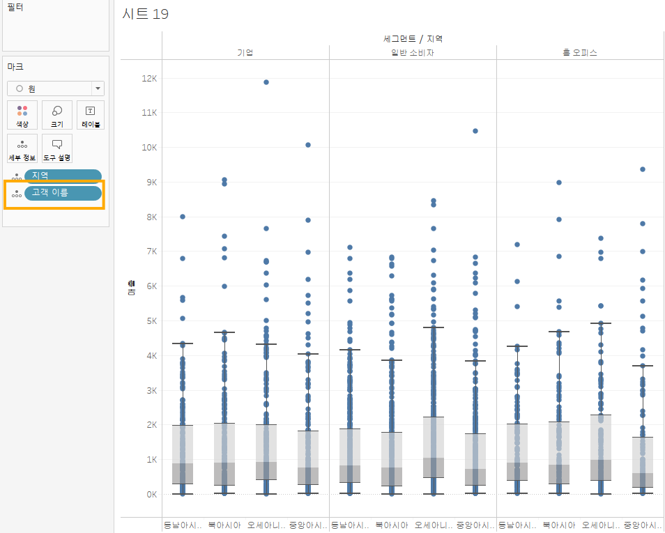
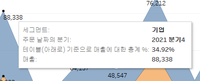

# Third Study Week

- 20강: [파이와 도넛차트](#20강-파이와-도넛차트)

- 21강: [워드와 버블차트](#21강-워드와-버블차트)

- 22강: [이중축과 결합축](#22강-이중축과-결합축)

- 23강: [분산형 차트](#23강-분산형-차트)

- 24강: [히스토그램](#24강-히스토그램)

- 25강: [박스플롯](#25강-박스플롯)

- 26강: [영역차트](#26강-영역차트)

- 27강: [간트차트](#27강-간트차트)

- 28강: [필터](#28강-필터)

- 29강: [그룹](#29강-그룹)


- 문제1 : [문제1](#문제1)

- 문제2 : [문제2](#문제2)

- 참고자료 : [참고자료](#참고-자료)


## Study Schedule

| 강의 범위     | 강의 이수 여부 | 링크                                                                                                        |
|--------------|---------|-----------------------------------------------------------------------------------------------------------|
| 1~9강        |  ✅      | [링크](https://youtu.be/3ovkUe-TP1w?si=CRjj99Qm300unSWt)       |
| 10~19강      | ✅      | [링크](https://www.youtube.com/watch?v=AXkaUrJs-Ko&list=PL87tgIIryGsa5vdz6MsaOEF8PK-YqK3fz&index=75)       |
| 20~29강      | ✅      | [링크](https://www.youtube.com/watch?v=Qcl4l6p-gHM)      |
| 30~39강      | 🍽️      | [링크](https://www.youtube.com/watch?v=e6J0Ljd6h44&list=PL87tgIIryGsa5vdz6MsaOEF8PK-YqK3fz&index=55)       |
| 40~49강      | 🍽️      | [링크](https://www.youtube.com/watch?v=AXkaUrJs-Ko&list=PL87tgIIryGsa5vdz6MsaOEF8PK-YqK3fz&index=45)       |
| 50~59강      | 🍽️      | [링크](https://www.youtube.com/watch?v=AXkaUrJs-Ko&list=PL87tgIIryGsa5vdz6MsaOEF8PK-YqK3fz&index=35)       |
| 60~69강      | 🍽️      | [링크](https://www.youtube.com/watch?v=AXkaUrJs-Ko&list=PL87tgIIryGsa5vdz6MsaOEF8PK-YqK3fz&index=25)       |
| 70~79강      | 🍽️      | [링크](https://www.youtube.com/watch?v=AXkaUrJs-Ko&list=PL87tgIIryGsa5vdz6MsaOEF8PK-YqK3fz&index=15)       |
| 80~89강      | 🍽️      | [링크](https://www.youtube.com/watch?v=AXkaUrJs-Ko&list=PL87tgIIryGsa5vdz6MsaOEF8PK-YqK3fz&index=5)        |


<!-- 여기까진 그대로 둬 주세요-->
<!-- 이 안에 들어오는 텍스트는 주석입니다. -->

# Third Study Week

## 20강: 파이와 도넛차트
<!-- 파이와 도넛차트에 관해 배우게 된 점을 적어주세요 -->
- 파이차트  


- 파이차트 임의의 축 설정  

  

파이차트는 축이 없으므로, 임의로 열에 0 입력하여 축 설정  


> **🧞‍♀️ 도넛차트를 생성하는 법을 기록해주세요.**
  

Ctrl+드래그로 두 개의 파이 차트 생성 후, 오른쪽은 매출 합계를 나타내는 파이차트로 변경  


오른쪽 차트 이중 축으로 변경  


## 21강: 워드클라우드와 버블차트
<!-- 워드클라우드와 버블차트에 관해 배우게 된 점을 적어주세요 -->
- 버블차트  


표현 방식-버블차트 선택  


마크에서 원하는 색으로 변경 가능  


- 워드클라우드  


국가/지역 우클릭+드래그-마크-크기, 카운트 선택  


국가/지역을 마크-텍스트로 드래그, [텍스트] 선택, 매출을 색상으로 표시  


## 22강: 이중축과 결합축
<!-- 이중축과 결합축에 관해 배우게 된 점을 적어주세요 -->


제품 ID를 세부 정보, 하위 범주를 색상으로 표시  

(제조업체 못 찾아서 제품 ID로 함)  


분석 탭-추세선으로 추세선 표시 가능  


범주별 추세선이 표시됨  


전체 추세선만 표시하려면, 추세선 우클릭-모든 추세선 편집에서 변경 가능  

- 전체+범주별 추세선 한 번에 보기  


열(매출) 복사하여 추세선 편집, 이중 축으로 합칠 수 있음  


## 23강: 분산형 차트
<!-- 분산형 차트에 관해 배우게 된 점을 적어주세요 -->


주문 날짜 우클릭+드래그-분기 선택, 이중축 선택하여 두 그래프 합치기  


우측 축 우클릭-축 동기화  


축 동기화된 이중축 그래프 생성됨  

- 결합된 축  


수익-기존 그래프 왼쪽 축으로 드래그→결합된 축 생성됨(가장 큰 범위의 축을 공유함)  


## 24강: 히스토그램
<!-- 히스토그램에 관해 배우게 된 점을 적어주세요 -->
- 구간 차원: 일정한 크기의 포켓을 만들어 그 안에 값을 담아 표현시키기 위한 도구  

  


구간차원 필드가 생성됨.

열로 설정-연속형으로 변경  


- 구간차원 없이 수익에 대한 히스토그램 만들기  

  

표현방식-히스토그램 선택 시 앞서 진행한 프로세스가 자동으로 실행됨  


범주-색상으로 범주별 분포 확인 가능  


축 우클릭하여 범위 설정 가능  


## 25강: 박스플롯
<!-- 박스플롯에 관해 배우게 된 점을 적어주세요 -->
열-세그먼트, 지역 / 행-매출  


표현 방식-박스플롯  


잘 표현되지 않음.  



고객 이름을 세부 정보로 표시  


세그먼트-색상 표시 가능


## 26강: 영역차트
<!-- 영역차트에 관해 배우게 된 점을 적어주세요 -->
영역 차트: 누계를 보기 편하게 하기 위한 차트.


분기별 세그먼트에 따른 매출을 확인할 수 있음.


매출-퀵테이블 계산-구성비율, 다음을 사용하여 계산-테이블 아래로 선택



그래프에서 비율 확인 가능

## 27강: 간트차트
<!-- 간트차트에 관해 배우게 된 점을 적어주세요 -->
배송기간(배송 날짜-주문 날짜) 계산


분석-계산된 필드 만들기에서 DAYDIFF(’day’, [주문 날짜], [배송 날짜]) 입력


간트 차트, 배송기간 평균으로 설정, 하위 범주 표시

구분이 힘드므로 고객별 배송기간 표시해보기


고객 이름 필터로 설정, 단일값(드롭다운)으로 필터 형식 변경


배송 형태별로 다른 색상으로 나타냄


## 28강: 필터
<!-- 필터에 관해 배우게 된 점을 적어주세요 -->
- 추출 필터 추가-주문 날짜-년-2021년
- 데이터 원본 필터-우측 상단 필터 추가 클릭
- 컨텍스트 필터: 상위 필터.      
    기술 범주의 상위 10개 제품 이름을 설정하고자 함


데이터가 잘리는 현상.

범주:기술을 컨텍스트 필터로 설정해야 함→’컨텍스트에 추가’


## 29강: 그룹
<!-- 그룹에 관해 배우게 된 점을 적어주세요 -->
드래그하여 그룹 선택 가능


마우스 우클릭-그룹 선택→데이터 패널에 새 필드 생성됨, 자동으로 색상 선택됨


그룹을 만들 수 있음


회사별로 어느 정도의 수익을 냈는지 확인

→차원에 있는 항목들을 여러 그룹으로 묶을 수 있다.

## 문제 1.

```js
유정이는 superstore 데이터셋에서 '주문' 테이블을 보고 있습니다.
1) 국가/지역 - 시/도- 도시 의 계층을 생성했습니다. 계층 이름은 '위치'로 설정하겠습니다.
2) 날짜의 데이터 타입을 '날짜'로 바꾸었습니다.

코로나 시기의 도시별 매출 top10을 확인하고자
1) 배송 날짜가 코로나시기인 2021년, 2022년에 해당하는 데이터를 필터링했고
2) 위치 계층을 행으로 설정해 펼쳐두었습니다.
이때, 매출의 합계가 TOP 10인 도시들만을 보았습니다.
```


```
겉보기에는 전체 10개로, 잘 나온 결과처럼 보입니다. 그러나 유정이는 치명적인 실수를 저질렀습니다.
오늘 배운 '컨텍스트 필터'의 내용을 고려하여 올바른 풀이 및 결과를 구해주세요.
```

<!-- DArt-B superstore가 아닌 개인 superstore 파일을 사용했다면 값이 다르게 표시될 수 있습니다.-->
```
컨텍스트 필터는 다른 필터보다 먼저 적용되는 필터로, 년(배송날짜) 필드(2021, 2022)를 컨텍스트 필터로 적용하여야 이후 설정하는 필터들이 이 기간 내 데이터에만 적용된다.
```
먼저 배송 날짜를 필터 탭에 드래그하여, 2021, 2022년을 필터로 설정한다.


이를 우클릭-컨텍스트에 추가하여 컨텍스트 필터로 설정한다. 설정 시 해당 필드가 회색으로 변한다.


문제에 맞게 행, 열을 설정한다.


도시 필드는 필터 탭에 드래그하여, 상위 10개를 출력하도록 설정한다.


결과는 다음과 같다.


## 문제 2.

```js
태영이는 관심이 있는 제품사들이 있습니다. '제품 이름' 필드에서 '삼성'으로 시작하는 제품들을 'Samsung group'으로, 'Apple'으로 시작하는 제품들을 'Apple group'으로, 'Canon'으로 시작하는 제품들을 'Canon group'으로, 'HP'로 시작하는 제품들을 'HP group', 'Logitech'으로 시작하는 제품들을 'Logitech group'으로 그룹화해서 보려고 합니다. 나머지는 기타로 설정해주세요. 이 그룹화를 명명하는 필드는 'Product Name Group'으로 설정해주세요.

(이때, 드래그보다는 멤버 찾기 > 시작 문자 설정하여 모두 찾아 한번에 그룹화해 확인해보세요.)
```


---
제품 이름 필드 우클릭-만들기-그룹


필드명도 변경한다.


---
```js
해당 그룹별로 어떤 국가/지역이 주문을 많이 차지하는지를 보고자 합니다. 매출액보다는 주문량을 보고 싶으므로, 주문Id의 카운트로 계산하겠습니다.

기타를 제외하고 지정한 5개의 그룹 하위 목들만을 이용해 아래와 같이 지역별 누적 막대그래프를 그려봐주세요.
```


필터에서 Product Name Group의 기타는 제외하고, 행 선반에 드래그하여 놓는다.


주문id는 열 선반에 놓고, 측정값-카운트로 변경한다.

국가/지역 필드를 마크-색상으로 설정한다.

완성!

