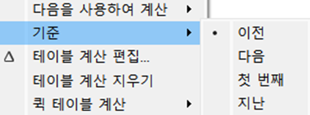

# Fourth Study Week

- 30강: [계층](#30-계층)

- 31강: [집합](#31-집합)

- 32강: [결합집합](#32-결합집합)

- 33강: [계산된 필드](#33-계산된-필드)

- 34강: [행수준계산](#34-행수준계산)

- 35강: [집계계산](#35-집계계산)

- 36강: [테이블계산](#36-테이블계산)

- 37강: [퀵테이블계산(1)](#37-퀵테이블계산1)

- 38강: [퀵테이블계산(2)](#38-퀵테이블계산2)

- [문제1](#문제-1)

- [문제2](#문제-2)

- [문제3](#문제-3)

## Study Schedule

| 강의 범위     | 강의 이수 여부 | 링크                                                                                                        |
|--------------|---------|-----------------------------------------------------------------------------------------------------------|
| 1~9강        |  ✅      | [링크](https://www.youtube.com/watch?v=AXkaUrJs-Ko&list=PL87tgIIryGsa5vdz6MsaOEF8PK-YqK3fz&index=84)       |
| 10~19강      | ✅      | [링크](https://www.youtube.com/watch?v=AXkaUrJs-Ko&list=PL87tgIIryGsa5vdz6MsaOEF8PK-YqK3fz&index=75)       |
| 20~29강      | ✅      | [링크](https://www.youtube.com/watch?v=AXkaUrJs-Ko&list=PL87tgIIryGsa5vdz6MsaOEF8PK-YqK3fz&index=65)       |
| 30~38강      | ✅      | [링크](https://youtu.be/e6J0Ljd6h44?si=nhGbB7GsdOCqj15f)       |
| 39~49강      | 🍽️      | [링크](https://www.youtube.com/watch?v=AXkaUrJs-Ko&list=PL87tgIIryGsa5vdz6MsaOEF8PK-YqK3fz&index=45)       |
| 50~59강      | 🍽️      | [링크](https://www.youtube.com/watch?v=AXkaUrJs-Ko&list=PL87tgIIryGsa5vdz6MsaOEF8PK-YqK3fz&index=35)       |
| 60~69강      | 🍽️      | [링크](https://www.youtube.com/watch?v=AXkaUrJs-Ko&list=PL87tgIIryGsa5vdz6MsaOEF8PK-YqK3fz&index=25)       |
| 70~79강      | 🍽️      | [링크](https://www.youtube.com/watch?v=AXkaUrJs-Ko&list=PL87tgIIryGsa5vdz6MsaOEF8PK-YqK3fz&index=15)       |
| 80~89강      | 🍽️      | [링크](https://www.youtube.com/watch?v=AXkaUrJs-Ko&list=PL87tgIIryGsa5vdz6MsaOEF8PK-YqK3fz&index=5)        |

<!-- 여기까진 그대로 둬 주세요-->

> **🧞‍♀️ 오늘의 스터디는 지니와 함께합니다.**


## 30. 계층

<!-- 계층 구조와 관련된 개념, 사용 방법 등을 적어주세요. -->
계층 만드는 법


복수의 필드 선택-계층-계층 만들기


계층을 사용해 항목들을 Drill Down해서 관련 값 찾을 수 있음

## 31. 집합

<!-- 집합의 정의 및 활용 방법에 대해 알게 된 점을 적어주세요. -->
- 집합: 어떤 조건을 설정하고 그 조건을 기반으로 데이터를 구분하는 방법.

수익을 많이 낸 상위 10개 도시를 집합으로 만들고자 함.


상위-필드기준 선택→새 필드 만들어짐


색상으로 구분 가능(색상 변경 가능: 조건을 충족한 데이터는 “IN”, 충족하지 않은 데이터는 “OUT”)


## 32. 결합집합

<!-- 결합집합의 개념 및 사용 사례를 적어주세요. -->
두 가지의 조건을 적용하고 싶을 때, 결합된 집합 사용 가능

매출 5만원 초과+수익률 1만원 이상인 도시

1) 매출>50000인 시/도


매출>5만이 “IN”으로 표시되었는지 확인


2) 수익>10000인 시/도

동일한 프로세스


3) 결합된 집합


(1) 두 집합의 모든 멤버: 매출 5만 초과 또는 수익 1만 초과

**(2) 두 집합의 공유 멤버: 매출 5만 초과이면서 수익 1만 초과**

(3) 공유 멤버를 제외한 “시/도 매출>50000”

(4) 공유 멤버를 제외한 “시/도 수익>10000”


## 33. 계산된 필드

<!-- 계산된 필드를 사용하는 방법과 예시를 적어주세요. -->
- 데이터 원본에 있는 필드를 활용하여 새로운 필드를 만드는 기능. 기존 데이터 이외에 계산해야 할 데이터가 추가로 필요한 경우 만들어 사용함.

1. 데이터 패널


2. 분석 탭


3. 필드 우클릭


- 사용법
    
    필드 입력: 필드 드래그 앤 드랍 또는 이름을 직접 입력(대괄호 사용)

    

    새 필드 생성됨

    


## 34. 행수준계산

<!-- 행수준 계산의 의미와 적용 방법을 적어주세요. -->

- 기본 계산:
    - 행 수준 계산: 데이터의 각 레코드를 통해 계산하는 방식
    - 집계 계산: 현재 뷰에서 보이는 기준으로 계산

예제 1) 고객 이름, 성 분리


고객 이름, 성이 공백 기준으로 분리됨

예제 2) 수익성 여부 판단


예제3) 주문 처리 일수 계산


## 35. 집계계산

<!-- 집계계산의 정의 및 활용 사례에 대해 알게 된 점을 적어주세요. -->

- 현재 뷰에서 보이는 기준으로 계산하는 방식

예제1) 연도별 주문건수


## 36. 테이블계산

<!-- 테이블 계산의 개념 및 사용 방법을 적어주세요. -->

뷰에 보이는 내용을 바탕으로 계산됨

예제 1) 월마다의 연도별 누적 매출

계산된 필드-테이블 계산에서 선택


계산된 필드는 삼각형으로 표시됨


기본적으로 테이블(옆으로)로 설정되어있음.

마우스 우클릭-다음을 사용하여 계산


또는 테이블 계산 편집으로 변경 가능


예제2) 현 월과 전 월의 차이


## 37. 퀵테이블계산(1)

<!-- 퀵테이블 계산의 원리 및 예제에 대해 알게 된 점을 적어주세요. -->

퀵 테이블 계산

가장 자주 쓰이는 테이블 계산 유형들을 클릭만으로 사용 가능하게 하는 기능.


[계산 유형]

1. 누계: 집계한 값을 누적한 값으로 한 번 더 집계해줌.
    
    예) 분기별 누적 매출&월별 매출 차트

    
    
    매출액 합계와 누계를 나타냄
    
    이중축, 축 동기화 선택

    

    더블클릭으로 적용된 함수 확인 가능

    

2. 차이: 측정값이 기준값과 어느 정도 차이 나는지 구하는 계산 유형
    
    예) 각 제품에 대한 연도별 매출 차이

    

    기준값 설정 가능

    

3. 비율 차이: 측정값 사이의 성장률 또는 % 차이
    
    예) 월별 수익 차이(%)

    

    막대그래프, 색상 설정. 범례에서 색상 조정 가능

    

4. 구성비율: 전체에서 각 항목들의 비중을 확인할 때 활용
    
    예) 지역별 제품 매출 순위와 구성비율
    

    순위가 표시됨.
    
    지역별 제품 매출 순위를 보고자 하므로, 다음을 사용하여 계산-패널(옆에서 아래로) 선택

    

    지역별 매출 순위가 표시됨.

    

    구성 비율: 데이터 패널의 ‘매출’ 필드를 더블 클릭해 하나 더 생성-구성 비율

    

    다음을 사용하여 계산-패널(아래로)

    

    지역별 구성비율의 합이 100%인 표 생성됨

    

5. 백분위수: 전체에서 각 항목들의 백분위수 표시
    
    예) 매출이 많은 고객과 적은 고객
    
    퀵테이블 계산-백분위수 선택

    

    오름차순/내림차순으로 고객 이름과 백분위수 확인 가능

    


## 38. 퀵테이블계산(2)

<!-- 이동평균, YTD 총계, 전년 대비 성장률, YTD 성장률 등 본 강의에서 알게 된 점을 적어주세요. -->

- 이동평균: 이전의 값부터 현재까지(연도 1월 1일~현재까지의 누계) 값에 대한 평균을 낼 때 사용. 주식 데이터에서 주로 활용
- YTD(Year to Date): 특정 시점을 기준으로 해당 연도부터 그 시점까지의 총계. 분기 또는 월이 있어야 사용 가능
- 통합 성장률(Compound Growth Rate): 특정 기간(연 단위) 동안 평균적으로 얼마나 성장했는지 나타내는 지표. 기업이나 시장 규모의 성장률 혹은 수익률을 평균으로 표현할 때 주로 사용. 산술평균이 아닌 기하평균.
- 전년 대비 성장률(Year Over Year Growth): 같은 월 기준 이전 연도 대비 성장률
- YTD 성장률(Year to Date Growth): 전년 동기 대비 얼마나 성장했는지 파악하는 지표.

- 자주 쓰이는 용어들
    + YoY(Year of Year) : 전년 비교
    + MoM(Month of Month) : 전월 비교
    + WoW(Week of Week) : 전주 비교

## 문제 1.

규석이는 이제껏 매출을 올리는 데에 힘썼었지만, 왠지 모르게 주머니에 들어오는 돈이 없어 속상합니다. 

그래서 매출이 상위 20곳에 속하지만, 수익률(%)이 마이너스인 시/도를 확인하려고 합니다.

> 수익률은 SUM([수익]) / SUM([매출])로 정의합니다.

어떤 집합을 만들었고, 어떤 결합을 하였는지를 중심으로 기술하고, 결과 자료를 첨부해주세요. 

(텍스트 표 형태이며, 색상으로 위 집합을 구분할 수 있게 만들어주세요.)

<!-- 아래 예시 이미지를 삭제하고, 직접 만든 시트 사진을 올려주세요. 시트의 이름은 본인 이름으로 기입해주세요-->


## 문제 2.
선희는 주문 Id별로 주문에서 배송까지에 걸리는 날짜 일수가 궁금했습니다. 
그래서 주문 ID별로 주문에서 배송까지 걸리는 일자를 '배송까지 걸린 일수'라는 계산된 필드로 만들고, 이를 마크에 올린 후 확인해보았습니다. 
이때, 계산된 필드의 식은 'DATEDIFF' 함수를 이용하였습니다.

배송까지 걸린 일수 계산을 위한 DATEDIFF 함수 수식을 적어주세요.

```
여기에 답을 적어주세요!
```


그런데 위 그림처럼 '주문 날짜'와 '배송 날짜'를 함께 행에 올려 확인해보니, 주문날짜와 배송날짜의 차이가 '배송까지 걸린 일수'와 다릅니다.

ID-2021-11126을 보니, 11월 26일 배송에 11월 30일 배송이면 4일 차이인데, 12일이 걸렸다고 하네요. 왜 이런 문제가 생긴걸까요?

```
여기에 답을 적어주세요!
```

그리고 이를 해결하기 위해서는 어떻게 해야 할까요?

```
여기에 답을 적어주세요!
```


## 문제 3.

다음은 Tableau의 다양한 계산을 사용할 수 있는 경우를 빈칸으로 두고 문제를 작성한 것입니다. 각 빈칸에 적합한 계산 유형을 채워보세요.

보기
> **누계, 차이, 비율 차이, 구성 비율, 순위, 백분위수, 이동 평균, YTD 총계, 통합 성장률, 전년 대비 성장률, YTD 성장률**

| 계산 유형               | 설명                                                                 | 사용 예시                                                                                          |
|-------------------------|----------------------------------------------------------------------|-----------------------------------------------------------------------------------------------------|
| 누계           | 데이터의 누적 합계를 계산                                             | 한 기업이 월별 매출 데이터를 누적하여 연간 매출 추이를 보고 싶을 때 사용                                      |
|  차이       | 연속 데이터 포인트 간의 차이를 계산                                    | 한 기업이 월별 매출 데이터에서 전월 대비 매출 증감량을 분석하고 싶은 경우                                        |
|  비율 차이         | 연속 데이터 포인트 간의 비율 변화를 계산                               | 한 기업이 월별 매출 데이터에서 전월 대비 매출 증감률(%)을 분석하고 싶은 경우                                      |
|  구성 비율       | 전체에서 각 데이터 포인트의 비율을 계산                                | 한 기업이 전체 매출에서 각 제품군이 차지하는 비율을 보고 싶을 때 사용                                           |
|  순위         | 데이터의 순위를 매깁니다                                              | 한 기업이 제품별 매출 데이터를 순위별로 정렬하여 상위 10개 제품을 분석하고 싶은 경우                              |
|  백분위수         | 데이터의 백분위를 계산                                               | 한 기업이 고객별 구매 금액 데이터를 백분위수로 나누어 상위 25% 고객을 분석하고 싶은 경우                          |
| 이동평균          | 일정 기간의 평균을 계산                                               | 한 기업이 주간 매출 데이터에서 4주 이동 평균을 계산하여 트렌드를 분석하고 싶은 경우                              |
| YTD 총계      | 연초부터 현재까지의 총계를 계산                                      | 한 기업이 월별 매출 데이터를 연초부터 현재까지 누적하여 연간 매출 목표 달성 여부를 분석하고 싶은 경우             |
| 통합성장률 | 일정 기간 동안의 연평균 성장률을 계산                                  | 한 기업이 5년 간 매출 데이터를 바탕으로 연평균 성장률(CAGR)을 계산하고 싶은 경우                                  |
| 전년 대비 성장률      | 전년 동기간 대비 성장률을 계산                                        | 한 기업이 월별 매출 데이터에서 전년 동월 대비 매출 성장률을 분석하고 싶은 경우                                    |
| YTD 성장률        | 연초부터 현재까지의 성장률을 계산                                     | 한 기업이 올해 연초부터 현재까지의 매출이 전년 동기 대비 얼마나 성장했는지 분석하고 싶은 경우                     |

> 사용 예시를 참고하여 실제 경우처럼 생각하며 고민해보아요!