# Fifth Study Week

- 39강: [LOD](#39강-lod)

- 40강: [EXCLUDE](#40-lod-exclude)

- 41강: [INCLUDE](#41-lod-include)

- 42강 : [매개변수](#42-매개변수)

* (43강이 없어 패스합니다)
- 44강: [매개변수 실습](#44-매개변수-실습)

- 45강: [마크카드](#45-워크시트-마크카드)

- 46강: [서식계층](#46-서식-계층)

- 47강: [워크시트](#47-워크시트-서식)

- [문제1](#문제-1)

- [문제2](#문제-2)

- [문제3](#문제-3)

## Study Schedule

| 강의 범위     | 강의 이수 여부 | 링크                                                                                                        |
|--------------|---------|-----------------------------------------------------------------------------------------------------------|
| 1~9강        |  ✅      | [링크](https://www.youtube.com/watch?v=AXkaUrJs-Ko&list=PL87tgIIryGsa5vdz6MsaOEF8PK-YqK3fz&index=84)       |
| 10~19강      | ✅      | [링크](https://www.youtube.com/watch?v=AXkaUrJs-Ko&list=PL87tgIIryGsa5vdz6MsaOEF8PK-YqK3fz&index=75)       |
| 20~29강      | ✅      | [링크](https://www.youtube.com/watch?v=AXkaUrJs-Ko&list=PL87tgIIryGsa5vdz6MsaOEF8PK-YqK3fz&index=65)       |
| 30~38강      | ✅      | [링크](https://www.youtube.com/watch?v=e6J0Ljd6h44&list=PL87tgIIryGsa5vdz6MsaOEF8PK-YqK3fz&index=55)       |
| 39~47강      | ✅      | [링크](https://www.youtube.com/watch?v=AXkaUrJs-Ko&list=PL87tgIIryGsa5vdz6MsaOEF8PK-YqK3fz&index=45)       |
| 50~59강      | 🍽️      | [링크](https://www.youtube.com/watch?v=AXkaUrJs-Ko&list=PL87tgIIryGsa5vdz6MsaOEF8PK-YqK3fz&index=35)       |
| 60~69강      | 🍽️      | [링크](https://www.youtube.com/watch?v=AXkaUrJs-Ko&list=PL87tgIIryGsa5vdz6MsaOEF8PK-YqK3fz&index=25)       |
| 70~79강      | 🍽️      | [링크](https://www.youtube.com/watch?v=AXkaUrJs-Ko&list=PL87tgIIryGsa5vdz6MsaOEF8PK-YqK3fz&index=15)       |
| 80~89강      | 🍽️      | [링크](https://www.youtube.com/watch?v=AXkaUrJs-Ko&list=PL87tgIIryGsa5vdz6MsaOEF8PK-YqK3fz&index=5)        |


<!-- 여기까진 그대로 둬 주세요-->

> **🧞‍♀️ 오늘의 스터디는 지니와 함께합니다.**


## 39강. LOD

<!-- INCLUDE, EXCLUDE, FIXED 등 본 강의에서 알게 된 LOD 표현식에 대해 알게 된 점을 적어주세요. -->
- LOD(Level of Detail): 뷰의 세부 수준을 나타냄. 계산할 수준을 세부적으로 제어 가능하도록 함.
- LOD 표현식: INCLUDE, EXCLUDE, FIXED
- FIXED LOD: 현재 뷰에 있는 차원과 상관없이, 계산된 필드에서 원하는 차원을 따라 계산.
    예) 계산된 필드로 지역별 매출 표시
    - FIXED에서 설정한 차원이 뷰에 포함되어 있을 때
        
        { FIXED [지역] : SUM ([매출]) }

        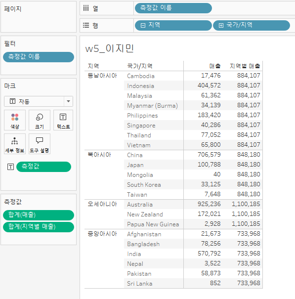
    
    - FIXED에서 설정한 차원이 뷰에 포함되어 있지 않을 때
        { FIXED [범주] : SUM([매출]) }

        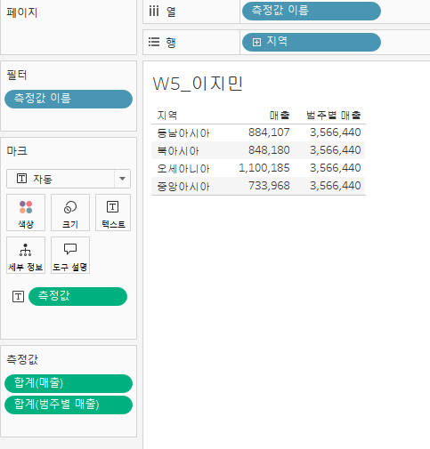

예제) 제품별 매출 구성 비율

퀵테이블 계산

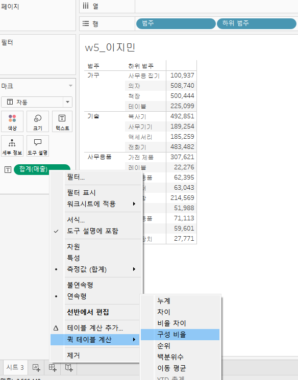

여기서 하위 범주를 선택하면, 선택된 범주를 100%로 간주하여 구성 비율을 계산함.  
FIXED 함수로 범주 선택과 관련없이 구성 비율을 표시하고자 함.

{ FIXED : SUM ([매출]) } 로 '전체 매출' 필드 생성   
SUM([매출]) / SUM([전체 매출]) 로 '제품 구성 비율' 필드 생성(필드 우클릭-기본 속성-숫자형식-백분율)

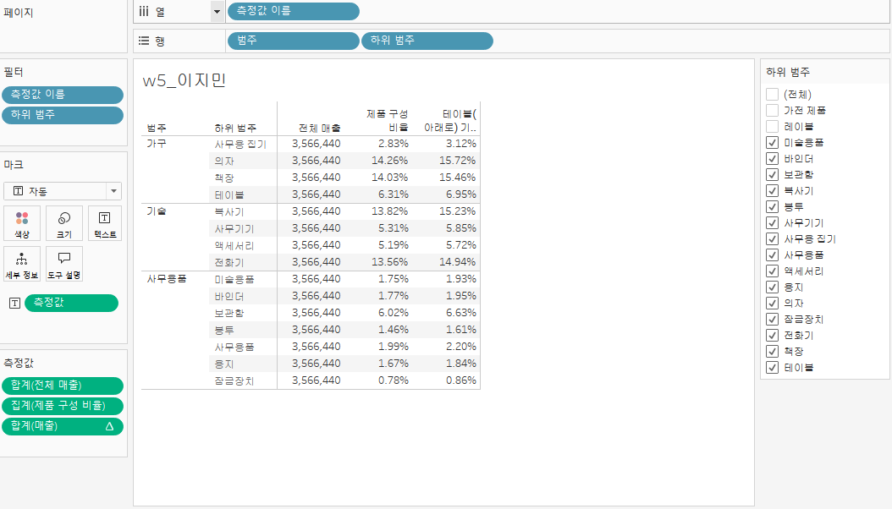

하위 범주를 몇 가지 제외해도, '제품 구성 비율'이 변하지 않음을 확인


## 40. LOD EXCLUDE

<!-- INCLUDE, EXCLUDE, FIXED 등 본 강의에서 알게 된 LOD 표현식에 대해 알게 된 점을 적고, 아래 두 질문에 답해보세요 :) -->

- EXCLUDE LOD: 현재 뷰에서 특정 차원을 제외하여 계산할 때 사용
예) 하위 범주에 따른 매출 보기: FIXED 또는 EXCLUDE 사용

{ FIXED [범주] : SUM([매출]) } 로 '범주별 매출 (Fixed)' 필드 생성
{ EXCLUDE [하위 범주] : SUM([매출]) } 로 '범주별 매출 (Exclude)' 필드 생성

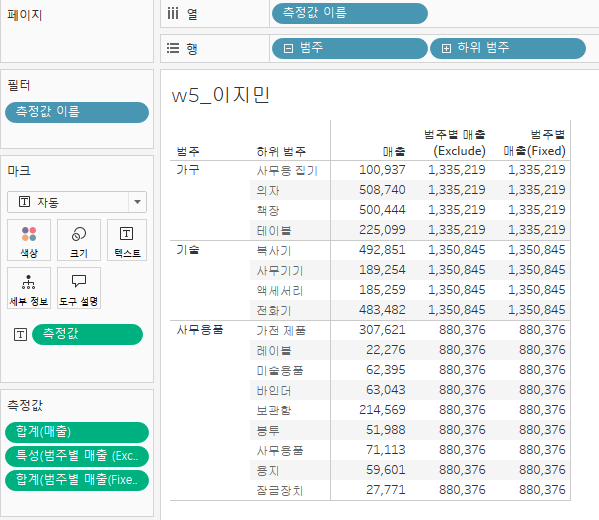

동일한 값.

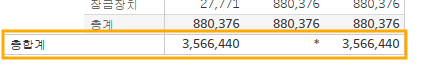

총계를 보면, 두 LOD 표현식이 '하위 범주' 차원이 아니라 설정한 '범주' 차원을 기준으로 계산되고 있음.

하위 수준(제품 id)를 표시하면,

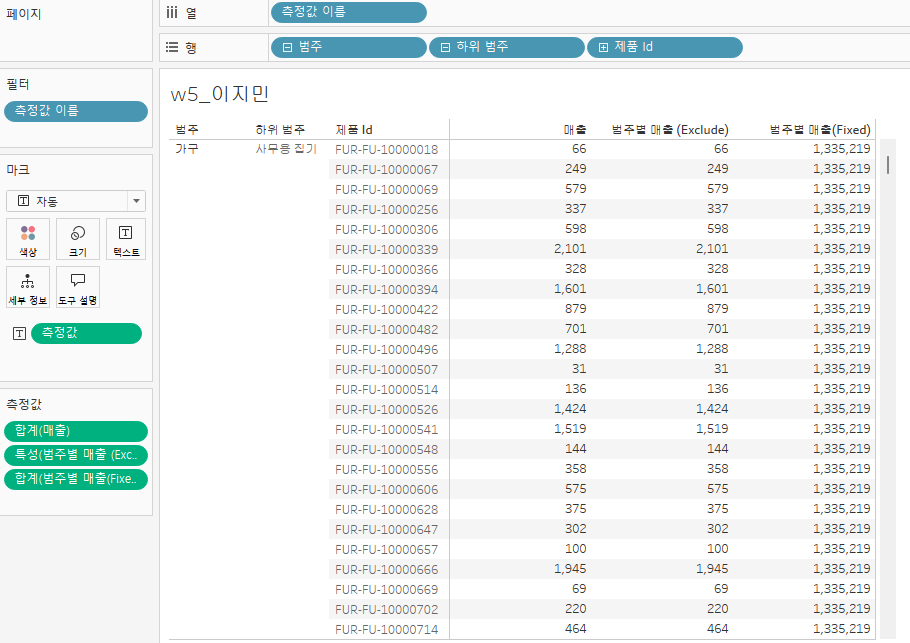

이와 같이 FIXED를 사용한 값은 변경되지 않지만, EXCLUDE를 사용한 값인 경우에는 값이 변경됨.

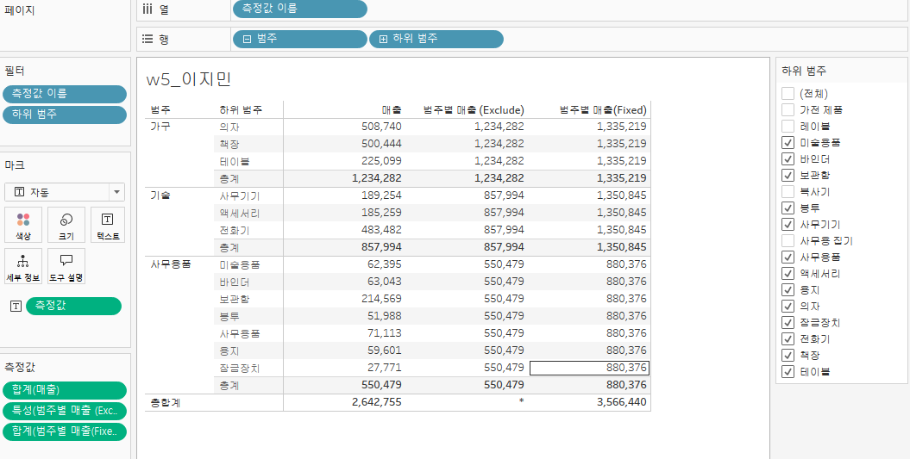

또한, 하위 범주에 필터를 걸어 몇 가지 하위 범주를 제외했을 때, EXCLUDE는 를 사용한 값은 변경되지만 FIXED를 사용한 값은 변경되지 않고 고정됨.


> **🧞‍♀️ FIXED와 EXCLUDE을 사용하는 경우의 차이가 무엇인가요?**

```
FIXED: 현재 뷰와 관계없이 특정 차원을 사용해 계산하므로 필터의 영향을 받지 않음.
EXCLUDE: 뷰에 있는 차원을 따라 계산하므로 관련 차원을 필터로 걸어보면 영향을 받음.
```

예제) 하위 범주 중 '액세서리' 매출을 기준으로 다른 제품들의 매출 차이 비교

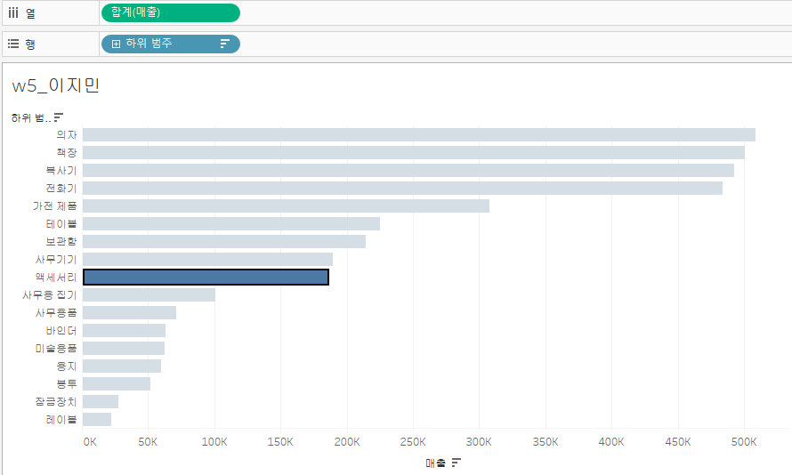

IF [하위 범주] = "액세서리" THEN [매출] END 로 '액세서리 매출' 필드 생성  
{EXCLUDE [하위 범주] : SUM([액세서리 매출]) }로 'EXCLUDE 하위 범주 매출' 필드 생성  
SUM([매출]) - ATTR([EXCLUDE 하위 범주 매출]) 로 '각 제품별 매출과 액세서리 매출의 차이' 필드 생성

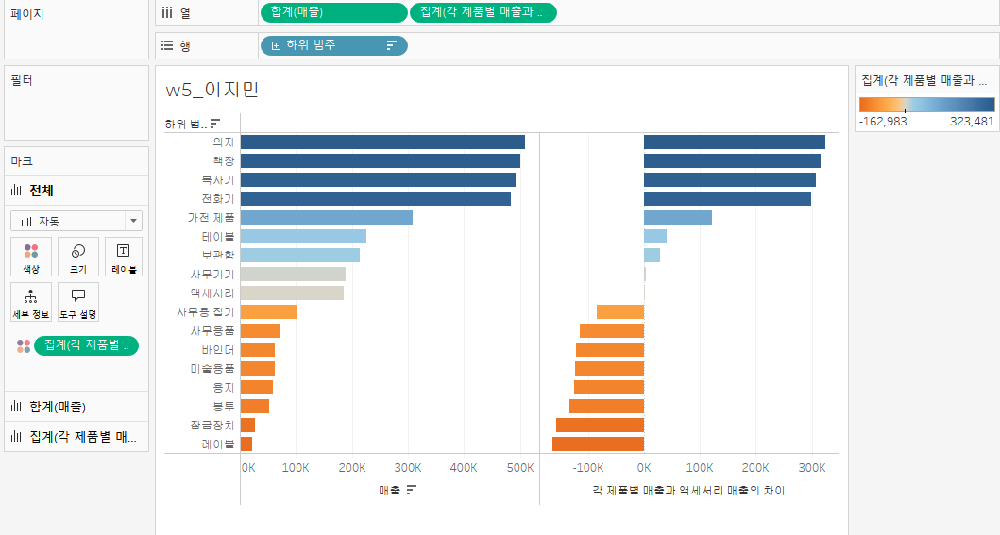

'각 제품별 매출과 액세서리 매출의 차이' 필드를 색상으로도 나타내면,
액세서리 매출과 비교했을 때 매출이 높은 제품은 파란색, 낮은 제품은 주황색 막대로 표시됨.

> **🧞‍♀️ 왜 ATTR 함수를 사용하나요?**

```
ATTR 함수는 데이터 집합 내에서 값이 여러 개인지를 확인하여, 단일 값을 반환하는 데 사용함.

예제의 경우, 'EXCLUDE 하위 범주 매출'이 여러 값이 있더라도 
ATTR 함수를 사용하여 단일 값으로 표시하므로, 오류 없이 계산을 이루어지게 함.
```


## 41. LOD INCLUDE

<!-- INCLUDE, EXCLUDE, FIXED 등 본 강의에서 알게 된 LOD 표현식에 대해 알게 된 점을 적고, 아래 두 질문에 답해보세요 :) -->

- INCLUDE LOD: 현재 뷰에서 특정 차원을 추가하여 계산.
EXCLUDE LOD 표현식과 같이 차원 필터를 통해 해당 값을 변경할 수 있음

예제)

AVG ( { INCLUDE [주문 ID] : SUM([매출]) } ) 로 '주문 ID에 따른 평균 매출' 필드 생성.  
(주문 ID 차원을 포함해서 합계한 매출에 평균을 반환한다는 의미)

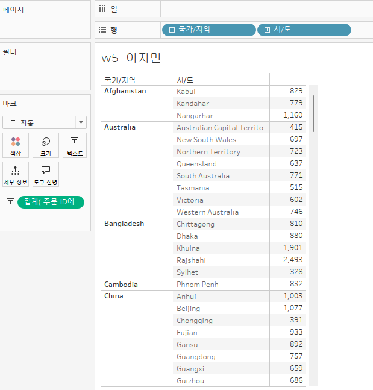

각 도시별 평균 매출 표시.

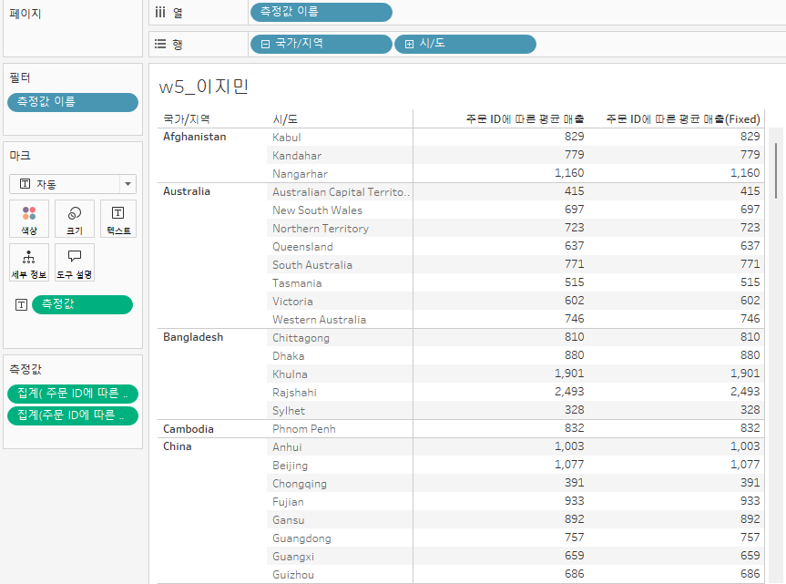

FIXED를 사용해도 동일한 결과 얻을 수 있음:  
AVG( { FIXED [주문 Id] : SUM([매출]) } )로 '주문 ID에 따른 평균 매출(Fixed)' 필드를 생성하여, 기존에 생성한 필드와 비교: 같은 결과.


> **🧞‍♀️ 그렇다면 어떤 경우에 각 표현식을 사용하나요? 예시와 함께 적어보아요**


```
FIXED LOD 표현식: 차원, 측정값 반환. 차원 필터에 영향을 받지 않음.
INCLUDE, EXCLUDE LOD 표현식: 측정값만 반환. 차원 필터에 영향을 받음.

예를 들어, '범주' 차원에서 매출 합계를 계산할 때 '하위 범주' 필터가 걸려있다면, 각 표현식을 사용할 때 다음의 결과가 나옴.
- FIXED: 관계 없이 '범주'의 매출 합계 표시
- INCLUDE/EXCLUDE: '하위 범주'를 포함/제외하고 매출 합계 표시
```

## 42. 매개변수(1)

<!-- 매개변수에 대해 알게 된 점을 적어주세요 -->

- 매개 변수  
고정된 상수 값이 아닌 동적인 값으로 변경하기 위해서 활용하는 기능.  
**계산식, 필터, 참조선**과 함께 사용.

### 매개변수: 필터

- 매개변수 만드는 방법
    1) 필터-드롭다운-새 매개변수 만들기
    2) 필드 우클릭-만들기-매개변수
    3) 데이터 패널

예제) 매출이 높은 상위 5개 제품을 표시하고자 함.

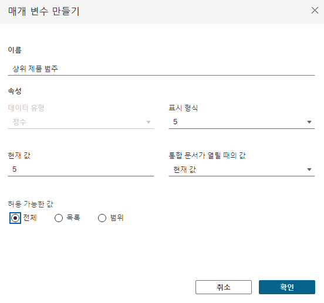

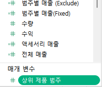

데이터 패널 아래에 매개변수 생성됨: 우클릭-매개 변수 표시

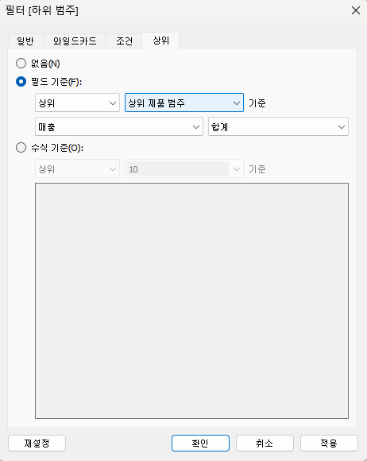

하위 범주 필터에서 드롭다운-'상위 제품 범주' 선택

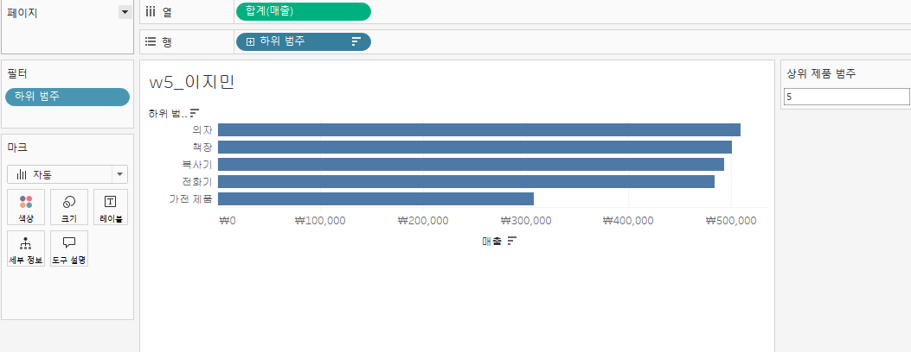

매출 상위 5개 제품이 표시됨


> **🧞‍♀️ 집합에도 매개변수를 적용할 수 있나요? 시도해봅시다**

하위 범주 필드 우클릭-만들기-집합-상위-필드기준 '상위 제품 범주', 마크-색상 설정

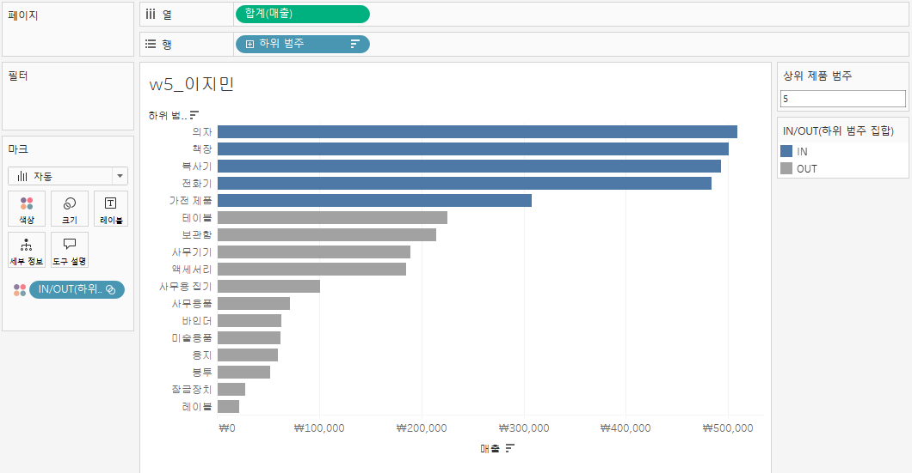

## 43. 매개변수(2)

### 매개변수: 계산식

매개변수 만들기

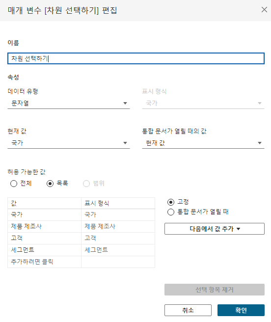

```
# 계산된 필드 만들기

CASE [차원 선택하기]
WHEN '국가' THEN [국가/지역]
WHEN '제품 제조사' THEN [제품 Id]
WHEN '고객' THEN [고객 이름]
WHEN '세그먼트' THEN [세그먼트] 
END

# '차원 선택하기' 매개 변수에서,
# '국가' 선택->'국가/지역',
# '제품 Id'->'제품 Id',
# '고객'->'고객 이름',
# '세그먼트'->'세그먼트' 가 나오도록 함.

```

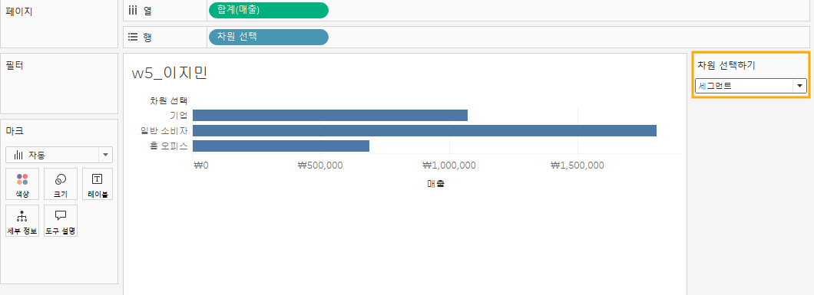

차원 선택하기 드롭다운에서 변경하여 볼 수 있음.

### 측정값

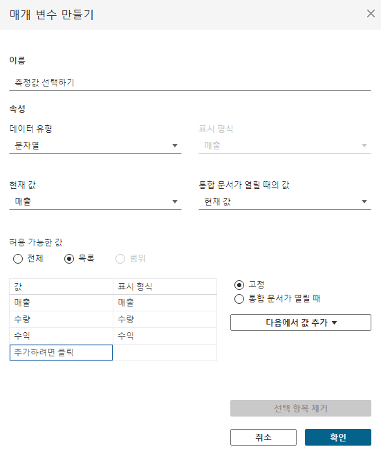
```
# 계산된 필드 만들기

CASE [측정값 선택하기]
WHEN '매출' THEN SUM([매출])
WHEN '수량' THEN SUM([수량])
WHEN '수익' THEN SUM([수익])
END
```
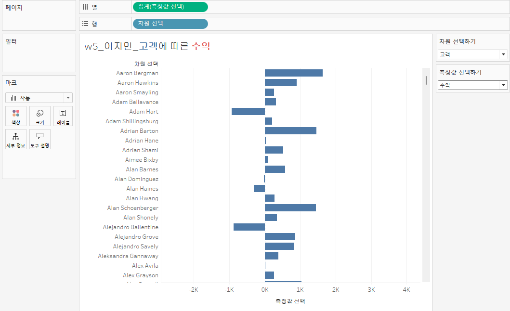

측정값 선택하기 드롭다운에서 변경하여 볼 수 있음.  
(매개 변수-우클릭-매개 변수 표시)


측정값에 단위 표시하기
```
# 계산된 필드 만들기

CASE [측정값 선택하기]
WHEN '매출' THEN '원'
WHEN '수량' THEN '개'
WHEN '수익' THEN '원'
END
```

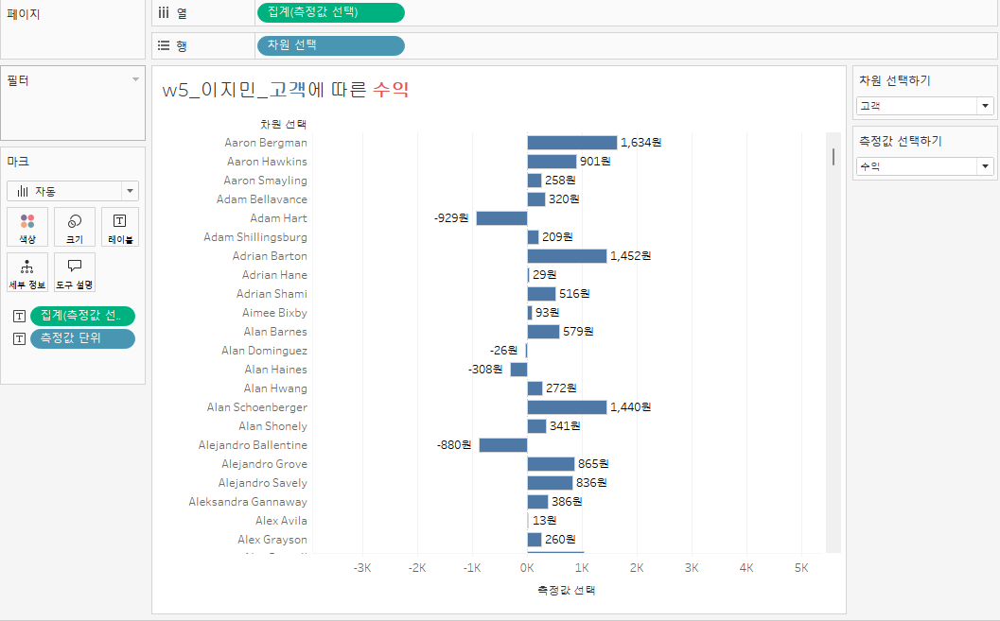

마크-레이블 드래그 앤 드롭

## 44. 매개변수 실습


<!-- 매개변수에 대해 알게 된 점을 적어주세요 -->
### 매개변수: 참조선

분석 탭-참조선-뷰로 드래그

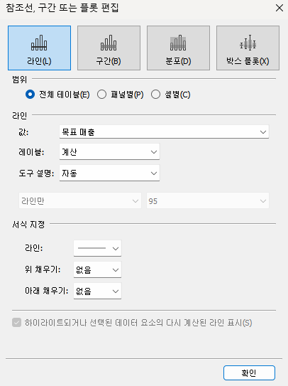

값을 매개변수로 설정

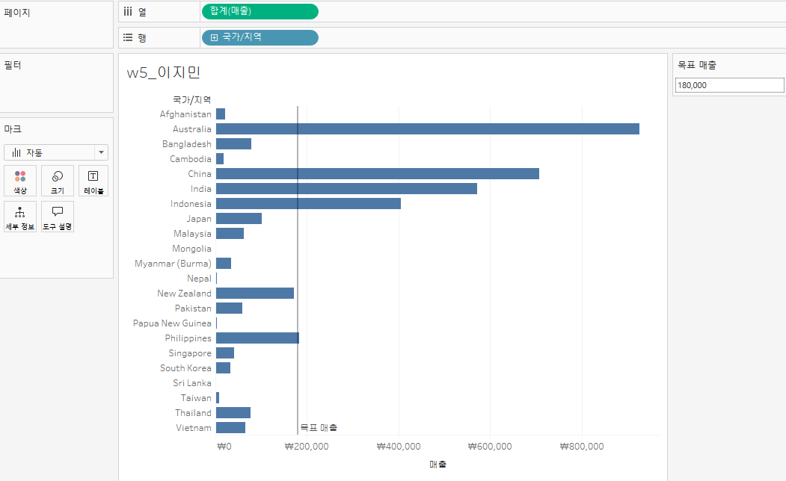

목표 매출 180,000으로 설정,   
목표 매출을 달성한 국가와 달성하지 못한 국가를 색상으로 구분하고자 함.
```
# 계산된 필드 만들기: KPI

IF SUM([매출]) >= [목표 매출]
THEN '목표 달성'
ELSE '목표 미달성'
END
```
마크-색상. 목표를 달성한 국가/지역은 초록색, 미달성은 회색으로 표시

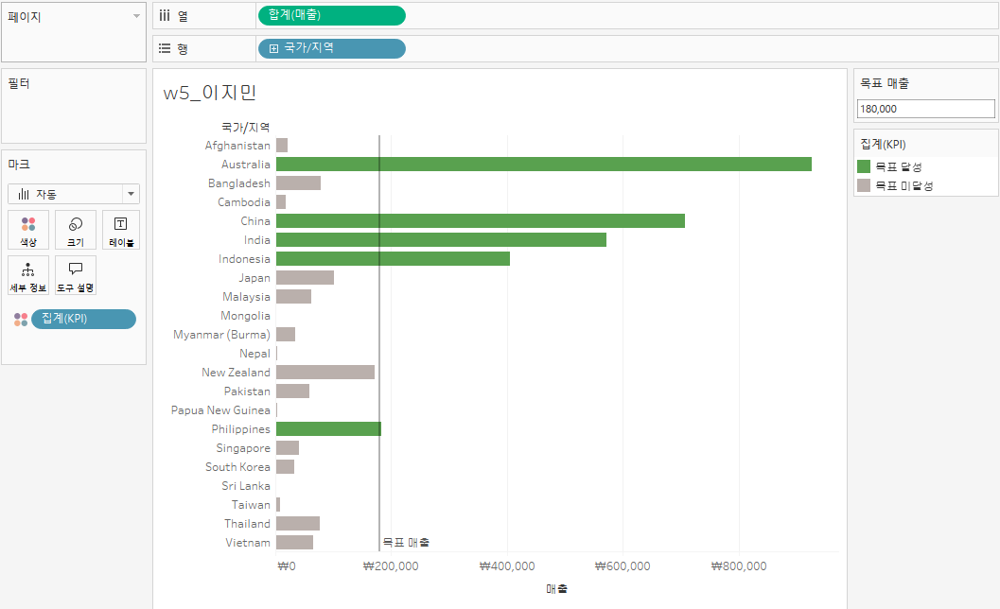

---
예제) 그래프에서 시작 날짜와 마지막 날짜를 선택할 수 있도록+해당 날짜 범위에 매출 합계를 나타내기

매개변수 만들기: 시작 날짜, 마지막 날짜. 데이터 유형-날짜

분석 패널-참조 구간 드래그(테이블 주문 날짜)

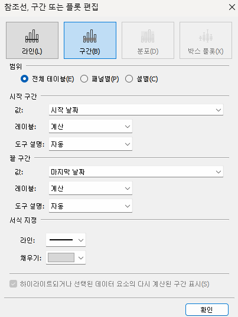

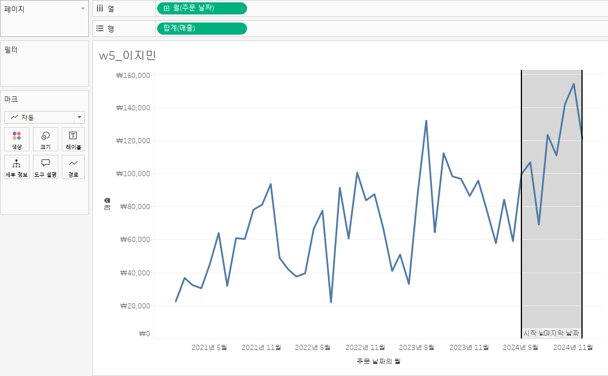

해당 날짜 범위의 매출 합계를 제목에서 나타내고자 함.
```
# 계산된 필드 만들기: 날짜 범위 매출 합계

TOTAL(SUM(IF [주문 날짜] >= [시작 날짜] AND [주문 날짜] <= [마지막 날짜] THEN 매출 END))
```

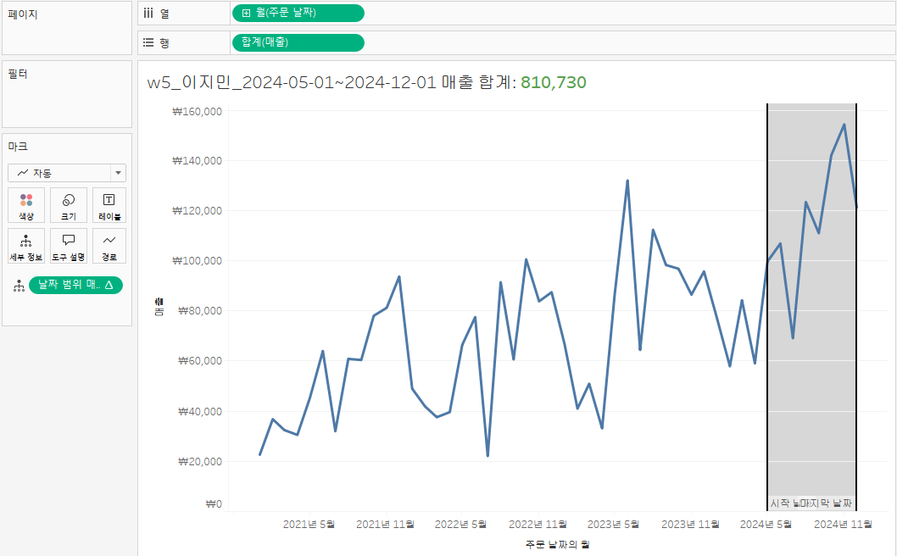


## 45. 워크시트 마크카드

<!-- 마크카드에 대해 알게 된 점을 적어주세요 -->
1) 드롭다운  
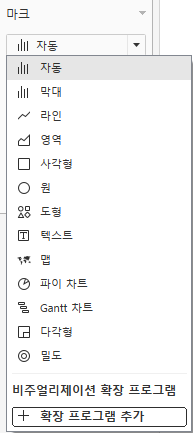

2) 색상  
마크 색상, 투명도, 테두리 설정 가능  
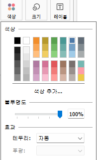  
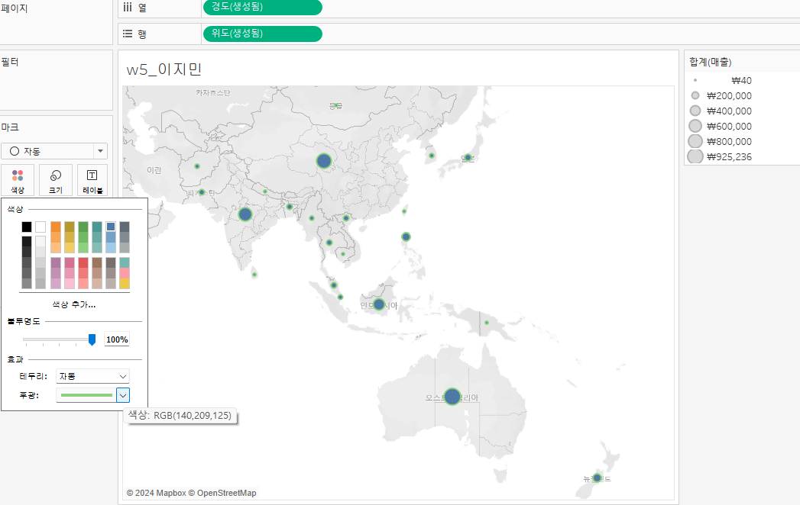  
후광: 맵차트에서만 사용
- 연속형 필드: 색상 범위 범례
- 불연속형 필드: 항목별 범례

3) 크기  
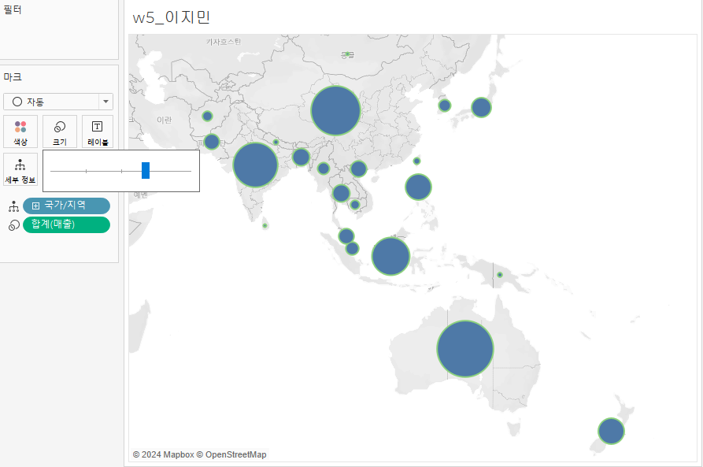  

4) 레이블  
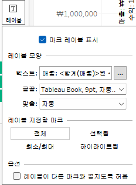  
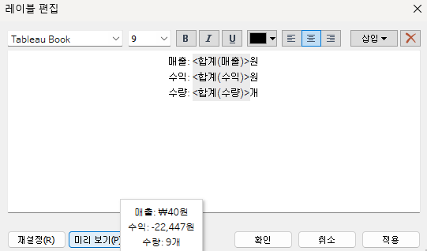  
텍스트를 원하는 형식, 폰트, 색상, 크기, 방향, 위치로 변경할 수 있음.

5) 세부 정보  
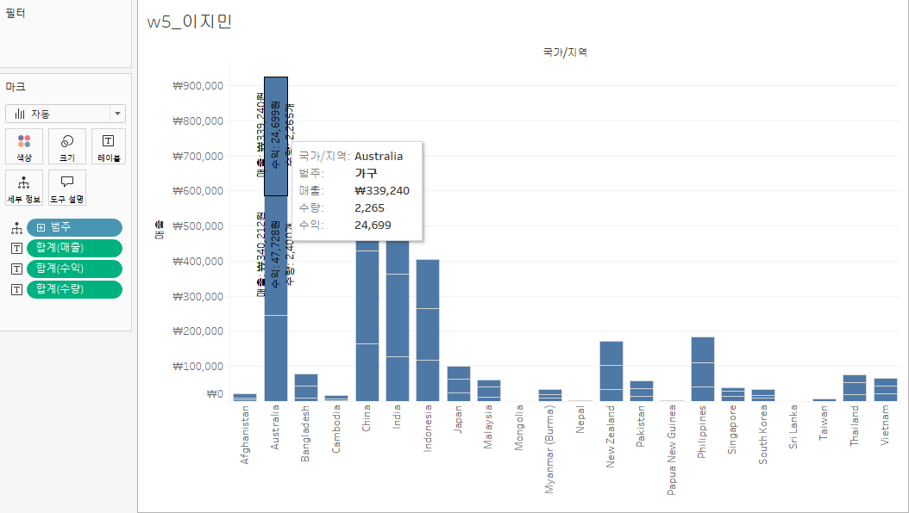

6) 도구 설명  
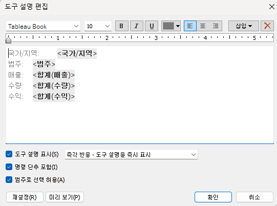


마크 카드는 차트 유형에 따라 여섯 번째 서식 옵션이 나타나기도 함.

예)  
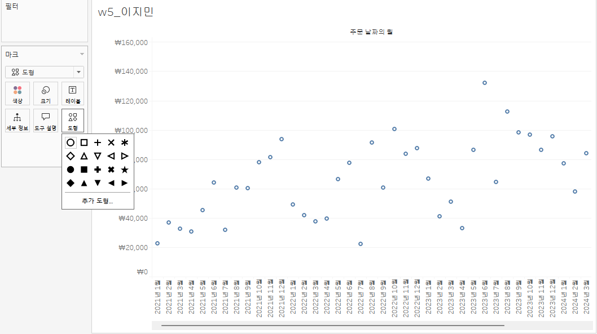


## 46. 서식 계층

<!-- 서식계층에 대해 알게 된 점을 적어주세요 -->
- 태블로의 서식 계층 구조
해당 서식 계층에서 상위 계층에 서식을 설정했을 때, 상위 계층보다 아래 계층인 경우에 서식을 변경하면 해당 아래 계층에 설정한 서식이 적용됨.

서식 탭 확인

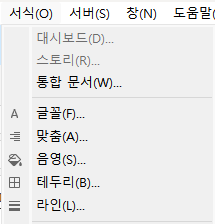

- 글꼴: 서식 패널의 시트 탭에 현재 워크 시트 서식 설정 가능  
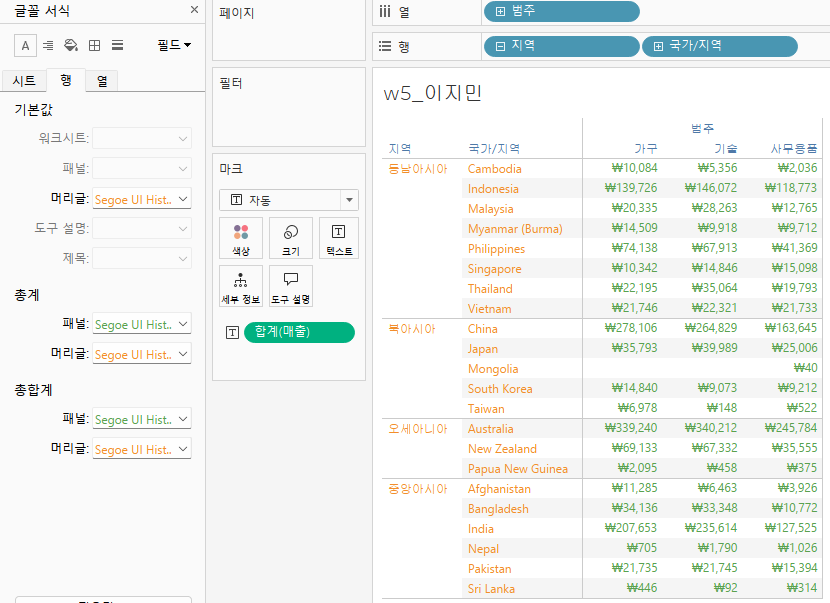  
시트, 행, 열 탭에서 세부 글꼴 조정  


- 특정 필드 서식 설정 방법: 서식 패널 우측 상단 '필드' 클릭 또는 뷰에서 마우스 우클릭-'서식'  
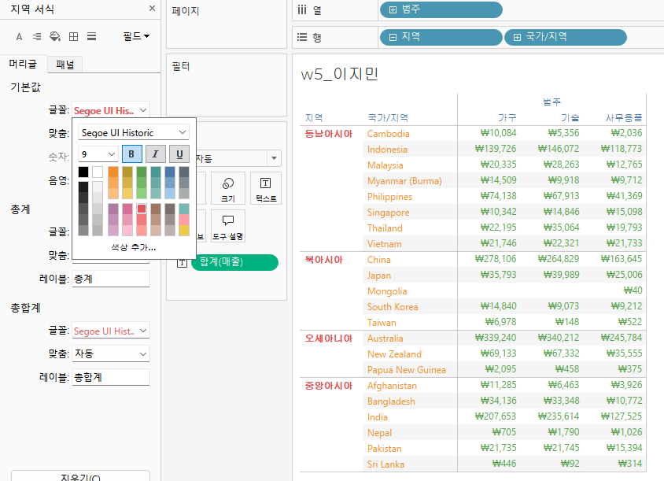

- 필드 레이블 서식  
해당 필드 레이블 우클릭-서식  
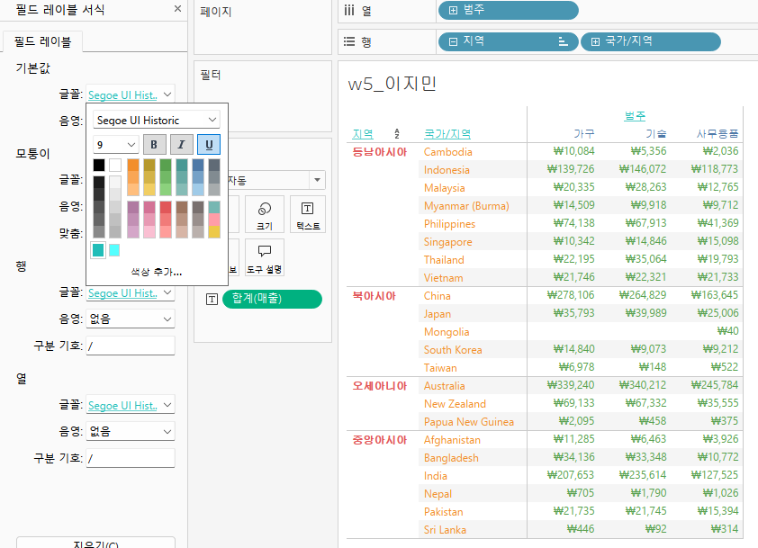

서식 탭-워크시트 서식 지우기로 설정했던 서식 전부 지울 수 있음.

마크카드에서 설정한 서식들만 그대로 남아있음.

> **🧞‍♀️ 서식계층을 일반적인 것에서 구체적인 것 순서로 기입해보세요**

```
워크시트 서식-행/열 서식-특정 필드-필드 레이블-도구설명/제목/마크
```
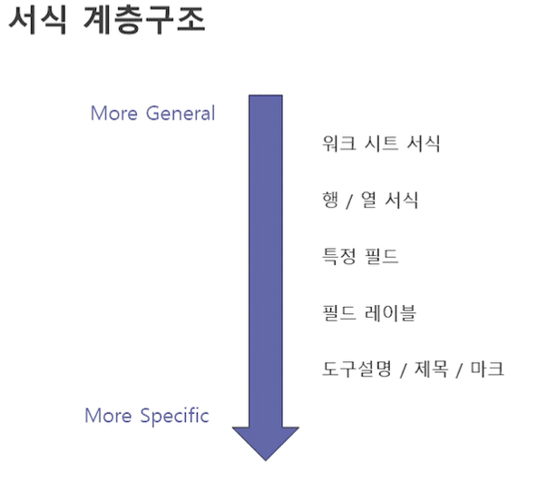

## 47. 워크시트 서식

<!-- 워크시트 서식에 대해 알게 된 점을 적어주세요!-->


서식 탭: 글꼴, 맞춤, 음영, 테두리, 라인 옵션

#### 글꼴  
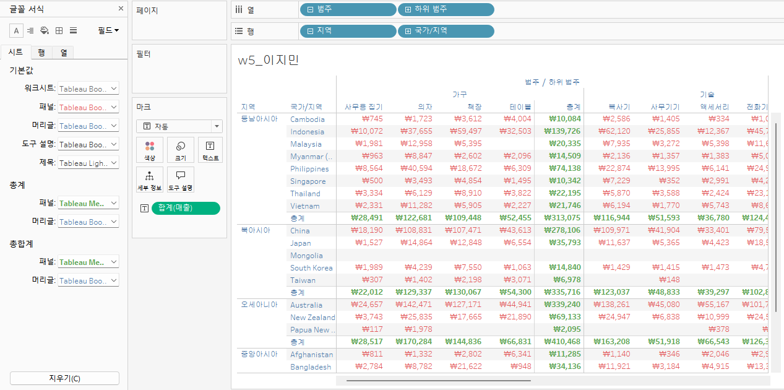
#### 맞춤  
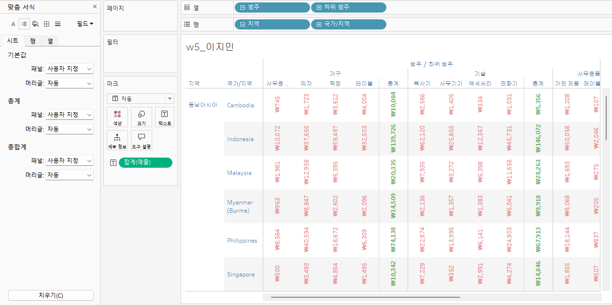
#### 음영  
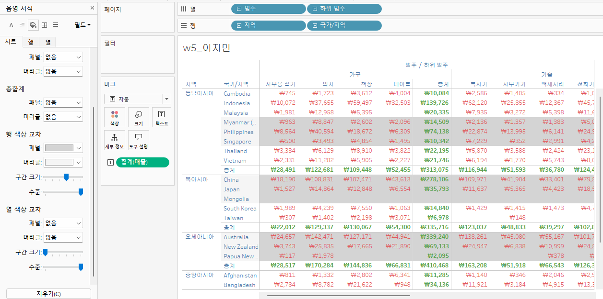

## 문제 리스트


## 문제 1.

```
가장 많이 주문한 사람들은 물건 배송을 빨리 받았을까요?
조건을 준수하여 아래 이미지를 만들어봅시다.
1) 국가/지역별(이하 '나라'로 통칭), 범주별로 배송일자가 다를 수 있으니 먼저, 나라별/범주별로 평균 배송일자를 설정한 뒤,
2) 각 나라에서 가장 많이 주문한 사람의 이름을 첫 번째 열,
3) 그 사람이 주문한 제품 이름을 2번째 열,
4) 각 상품이 배송까지 걸린 날 수를 표현하고
5) 그리고 만약 배송이 각 나라/범주별 평균보다 빨랐다면 '빠름', 같다면 '평균', 느리다면 '느림' 으로 print 해주세요. 
```

<!-- 여기까지 오는 과정 중 알게 된 점을 기입하고, 결과는 시트 명을 본인 이름으로 바꾸어 표시해주세요.-->
```
# 계산된 필드 만들기

# 배송까지 걸린 일수
DATEDIFF('day', [주문 날짜], [배송 날짜])

# 나라/범주 평균 배송일자
{ FIXED [국가/지역], [범주] : AVG([배송까지 걸린 일수]) }

# 배송 속도 수준
IF [배송까지 걸린 일수] < [나라/범주 평균 배송일자] THEN '빠름'
ELSEIF [배송까지 걸린 일수] = [나라/범주 평균 배송일자] THEN '평균'
ELSE '느림' 
END

# 나라별 최다 주문 고객
{ FIXED [국가/지역] : MAX({ FIXED [국가/지역], [고객 이름] : COUNT([주문 ID]) }) }

# 고객 주문 수
{ FIXED [국가/지역], [고객 이름] : COUNT([주문 ID]) }

# 나라별 최다 주문 고객 여부
IF [고객 주문 수] = [나라별 최대 주문 수] THEN 'O' ELSE '-' END

# 필터: 나라별 최다 주문 고객 여부 = O인 것만 필터링
```

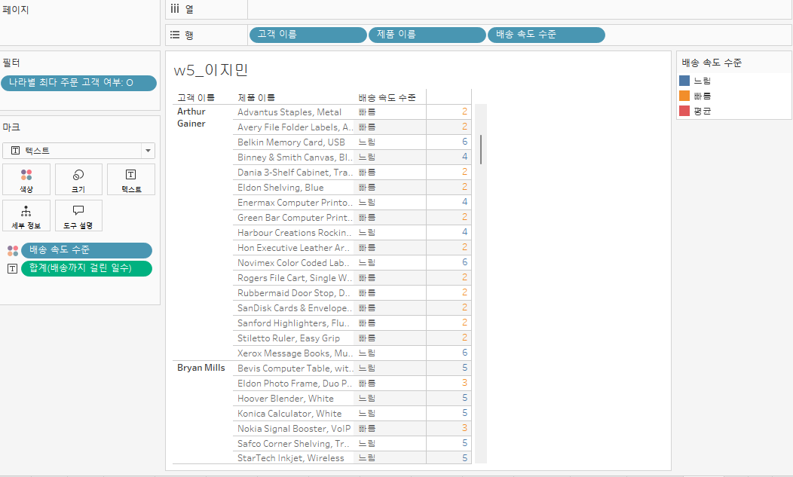

## 문제 2.

```
채원이는 태블로를 쓰실 수 없는 상사분께 보고하기 위한 대시보드를 만들고 싶어요. 

제품 중분류별로 구분하되 매개변수로써 수익, 매출, 수량을 입력하면 저절로 각각 지표에 해당하는 그래프로 바뀌도록 설계하고자 해요.

 어떤 값이 각 지표의 평균보다 낮은 값을 갖고 있다면 색깔을 주황색으로, 그것보다 높다면 파란색으로 표시하고 싶어요. 그 평균값은 각 지표별로 달라야 해요.
```

```
매개변수 만들기-문자열/목록-수익, 매출, 수량

# 문제2_지표 값
CASE [문제2_지표]
  WHEN "수익" THEN [수익]
  WHEN "매출" THEN [매출]
  WHEN "수량" THEN [수량]
END

# 문제2_지표 평균 (EXCLUDE)
{ EXCLUDE [하위 범주] : AVG([문제2_지표 값]) }


# 문제2_색상 구분
IF SUM([문제2_지표 값]) > ATTR([문제2_지표 평균 (EXCLUDE)]) THEN "높음"
ELSE "낮음"
END


```
ㅋㅋ색상구분실패......

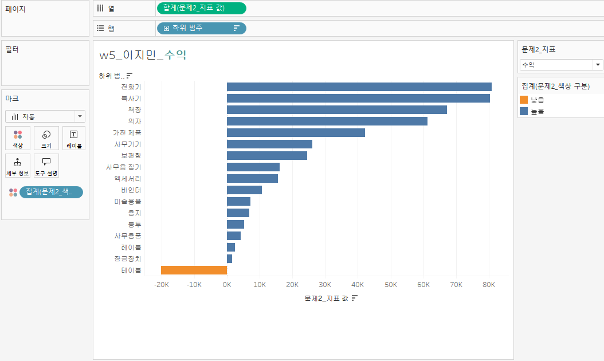