# Sixth Study Week

## Study Schedule
 

| 회차 | 강의 범위   | 강의 이수 여부 | 링크                                                                                                     |
|------|-------------|----------------|--------------------------------------------------------------------------------------------------------|
| 1    | 1~7강       | ✅              | [링크](https://www.youtube.com/watch?v=AXkaUrJs-Ko&list=PL87tgIIryGsa5vdz6MsaOEF8PK-YqK3fz&index=84)    |
| 2    | 8~17강      | ✅              | [링크](https://www.youtube.com/watch?v=AXkaUrJs-Ko&list=PL87tgIIryGsa5vdz6MsaOEF8PK-YqK3fz&index=75)    |
| 3    | 18~27강     | ✅              | [링크](https://www.youtube.com/watch?v=AXkaUrJs-Ko&list=PL87tgIIryGsa5vdz6MsaOEF8PK-YqK3fz&index=65)    |
| 4    | 28~37강     | ✅              | [링크](https://www.youtube.com/watch?v=e6J0Ljd6h44&list=PL87tgIIryGsa5vdz6MsaOEF8PK-YqK3fz&index=55)    |
| 5    | 38~47강     | ✅              | [링크](https://www.youtube.com/watch?v=AXkaUrJs-Ko&list=PL87tgIIryGsa5vdz6MsaOEF8PK-YqK3fz&index=45)    |
| 6    | 48~57강     | ✅              | [링크](https://www.youtube.com/watch?v=AXkaUrJs-Ko&list=PL87tgIIryGsa5vdz6MsaOEF8PK-YqK3fz&index=35)    |
| 7    | 58~67강     | 🍽️             | [링크](https://www.youtube.com/watch?v=AXkaUrJs-Ko&list=PL87tgIIryGsa5vdz6MsaOEF8PK-YqK3fz&index=25)    |
| 8    | 68~77강     | 🍽️             | [링크](https://www.youtube.com/watch?v=AXkaUrJs-Ko&list=PL87tgIIryGsa5vdz6MsaOEF8PK-YqK3fz&index=15)    |
| 9    | 78~85강     | 🍽️             | [링크](https://www.youtube.com/watch?v=AXkaUrJs-Ko&list=PL87tgIIryGsa5vdz6MsaOEF8PK-YqK3fz&index=5)     |
---

 
<!-- 여기까진 그대로 둬 주세요-->

> **🧞‍♀️ 오늘은 강의보다 실습과 대시보드 직접 만들기가 더 중요하니, 기록보다는 사고하며 강의를 들어주세요.**

## 48. 워크시트 서식(2)

<!-- 워크시트에 관해 본 강의에서 알게 된 점을 적어주세요 -->

서식 탭에서 선택 가능

#### 테두리

뷰에서 테두리 변경 가능

#### 라인
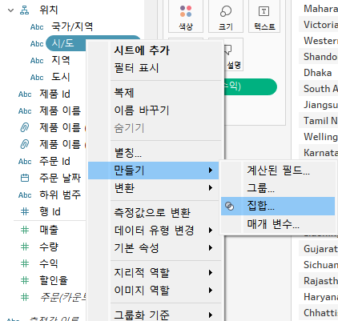

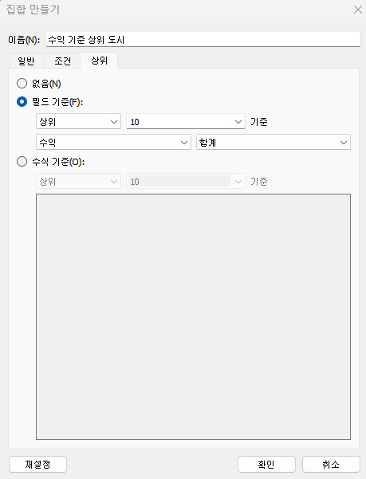

격자선, 영(0) 기준선, 추세선, 참조선 등의 서식 변경 가능

테두리와 라인의 차이: 데이터를 기준으로 구분 가능.
- 테두리: 뷰에서 테이블, 패널, 셀 및 머리글을 둘러싸는 라인의 서식을 설정하는 것
- 라인: 뷰에 표시된 데이터의 축에 대한 라인의 모양을 설정하는 것

## 49강. 대시보드패널

<!-- 대시보드패널 강의에서 알게 된 점을 적어주세요. -->

- 크기: 현재 대시보드 크기 설정  
드롭다운 메뉴로 구성되어 크기 선택 가능

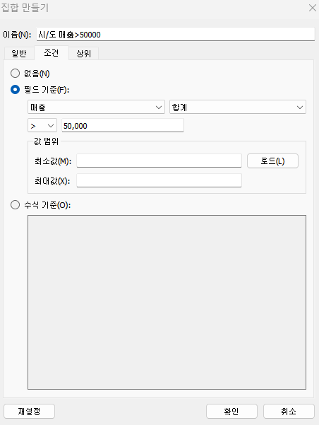

- 시트: 대시보드에서 사용할 수 있는 워크시트들. 현재 통합 문서에 있는 워크시트. 시트를 대시보드로 드래그 앤 드롭으로 나타낼 수 있음.

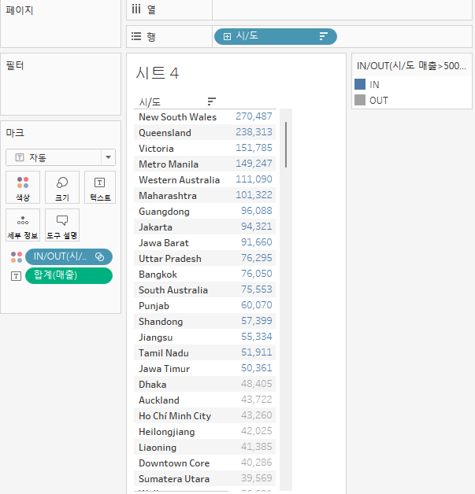

- 개체: 사용자가 만든 시트 외 다른 개체 추가 가능

여러 개체를 활용, 대시보드를 구성할 수 있다.

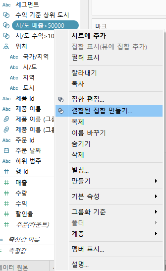

기기 유형별 해상도 및 크기 설정 가능

## 50. 대시보드 구성방식

<!-- 알게 된 점을 적고, 아래 질문에 답해보세요 :) -->

> **🧞‍♀️ 부동과 바둑판식 방식을 차이를 중점으로 기술해보세요**

#### 바둑판식
격자무늬 구조에 따라 개체 구성

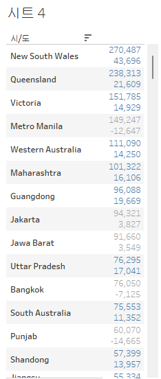

대시보드의 크기를 변경해도 개체가 유사한 형식을 유지하므로, 대시보드 크기를 자주 변경하는 경우 추천.

#### 부동
사용자가 원하는 대로 개체를 드래그 앤 드랍하여, 자유롭게 추가 및 배치

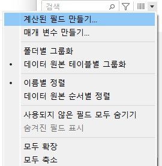

해당 개체를 움직이더라도 다른 개체의 크기나 모양에는 영향을 주지 않음.  
대시보드 크기가 자주 변경되지 않는 경우나, 그래프 내 빈 공간이 많은 경우 추천.

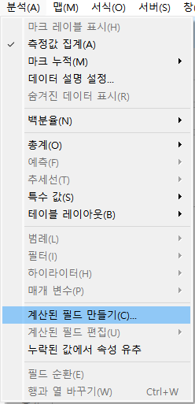

Shift+드래그 앤 드롭: 부동식으로 추가됨(해당 개체의 위치 및 형식을 다룰 수 있음)

부동식 구성 방식에서 대시보드 크기를 변경하면 택스트 개체의 위치가 변경됨.

## 51. 대시보드 컨테이너
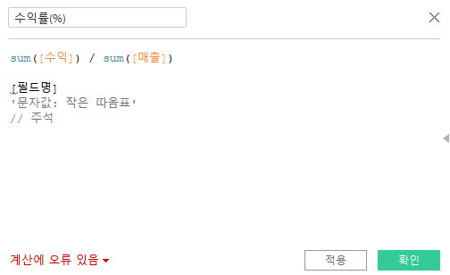

- 컨테이너: 대시보드 개체들과 워크시트들을 그룹화하고 구성할 수 있는 공간. 개체를 대시보드에 배치하기 전 컨테이너를 먼저 배치할 수 있음.
    - 가로 컨테이너: 내부 개체를 수평 공간으로 배열할 때 사용
    - 세로 컨테이너: 내부 개체를 수직 공간으로 배열할 때 사용

세로 컨테이너 안에 가로 컨테이너를 배치하고자 함.  
세로 컨테이너 배치->빈 페이지 배치->가로 컨테이너 배치

'레이아웃' 탭에서 잘 배치되었는지 확인

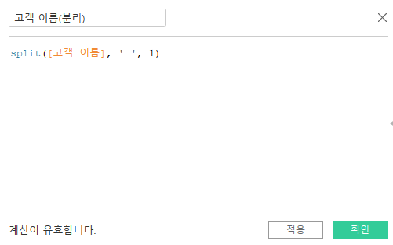

'텍스트', '이미지' 개체를 가로 컨테이너에 배치

만들어둔 시트를 가로 컨테이너+세로 컨테이너를 배치하여 하나씩 배치

## 52. 레이아웃 패널

레이아웃 탭: 대시보드의 개체 속성 변경

- 제목 표시: 워크시트 제목 표시/숨김
- 부동: 선택한 개체 자유롭게 이동
- 위치 및 크기: 개체의 위치와 크기를 픽셀 단위로 변경(부동 개체에만 적용됨)
- 테두리: 개체 테두리의 선 유형, 두께 및 색상 변경
- 백그라운드: 선택한 컨테이너 색상 변경
- 여백: 
    - 바깥쪽 여백: 컨테이너 모서리와 테두리 사이의 공간 변경
    - 안쪽 여백: 선택된 개체 모서리와 테두리 사이의 공간 변경

여러 레이아웃 변경

## 53. 필터 동작

<!-- 필터 동작에 대해 알게 된 점을 적어주세요 -->
대시보드에 필터 추가하기: 2가지 방법
1) 차트 클릭-'필터'  
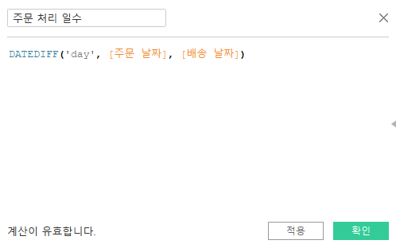  
필터를 새로운 컨테이너 또는 대시보드 내에서 볼 수 있음.  

2) 대시보드 탭-동작  
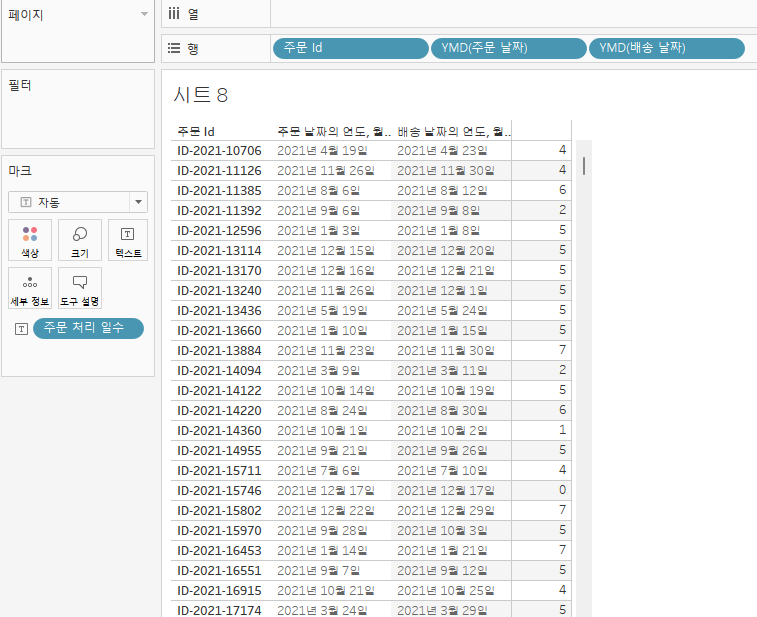  
옵션이 많은 경우, 이 옵션이 더 직관적일 수 있음.  

각 워크시트를 연계하기 위해, 대시보드 동작을 추가함.

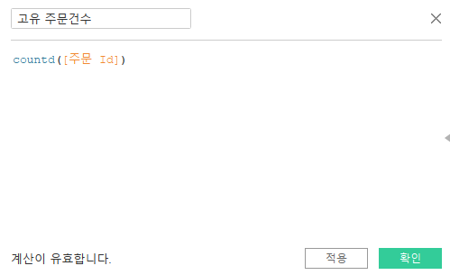

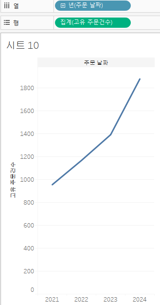

- 원본 시트: 해당 시트를 통해 동작
- 동작 실행 조건
    - 마우스오버: 차트의 마크 위에 마우스를 가져다 놓으면 나머지 데이터가 해당 마크의 데이터로 변경
    - 선택: 차트의 마크를 클릭했을 때 나머지 데이터가 클릭한 마크의 데이터로 변경
    - 메뉴: 마크를 클릭할 때 마크 도구 설명에 텍스트가 나타나며, 옵션을 선택해야 나머지 데이터가 변경됨
- 대상 시트: 원본 시트에서 동작을 실행했을 때, 동작이 적용될 워크시트
- 선택을 해제할 경우의 결과
    - 모든 값 표시: 선택을 해제할 시 대시보드에 전체 데이터가 보이도록 설정

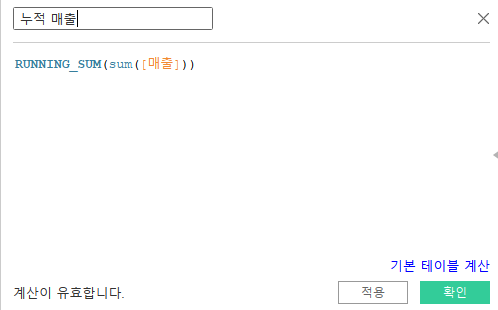

예) 맵차트-한국 클릭 시, 다른 모든 시트에서 동작함.

- 차트 클릭-필터로 사용(아이콘): 대시보드 동작 리스트에 동작이 추가됨.

## 54. 대시보드 하이라이터 동작

<!-- 하이라이터에 대해 알게 된 점을 적어주세요 -->
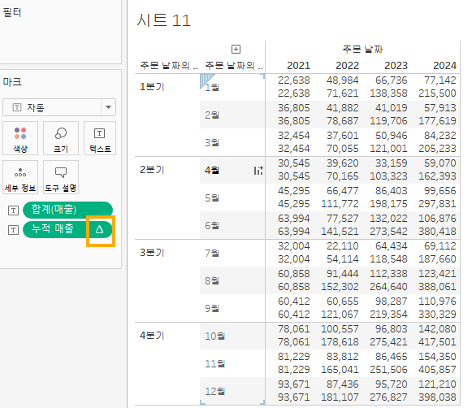
하위범주별 매출과 수익을 나타내는 막대그래프와 분산형차트를 대시보드에 나타냄.  
많은 하위범주 중 특정 하위 범주만 하이라이트로 나타내고자 함.

대시보드 탭-동작-동작 추가(드롭다운)-하이라이트

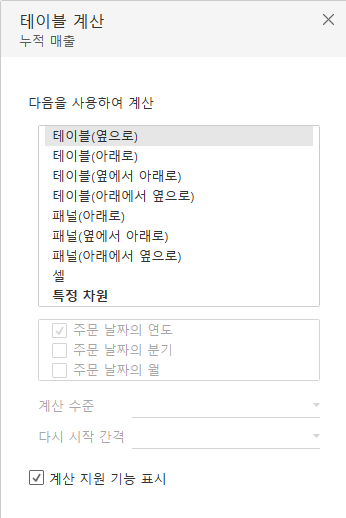

막대그래프의 하위 범주를 선택하면, 분산형 차트에서 주문 ID 마크가 하이라이트로 구분됨.
(단, 선택 기준으로 사용되는 필드(ex. 주문ID)가 대상 차트에 포함되어 있어야 함.)

## 55. 대시보드 URL

<!-- URL에 대해 알게 된 점을 적어주세요 -->
대시보드 동작을 이용해, 대시보드 내에서 웹사이트로 바로 이동 가능

대시보드 탭-동작-동작 추가(드롭다운)-URL로 이동

선택한 국가에 대한 위키피디아 페이지로 이동하도록 함

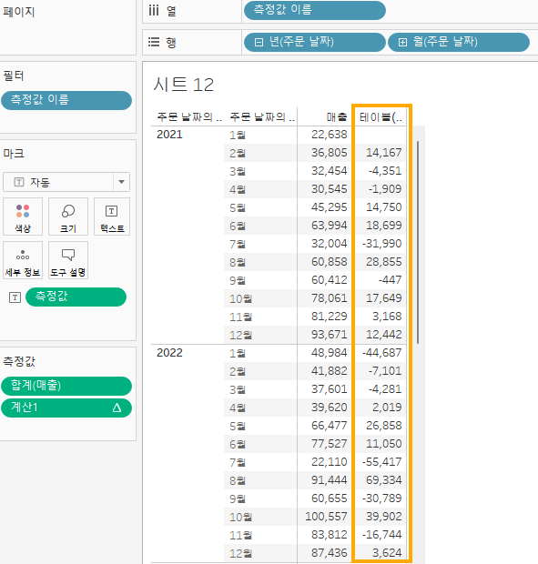

도구 설명 속 링크 클릭 시 해당 사이트로 이동함

웹페이지 개체를 대시보드에 배치하여, 차트 마크 선택 시 바로 웹페이지를 보이게 할 수도 있음.

  

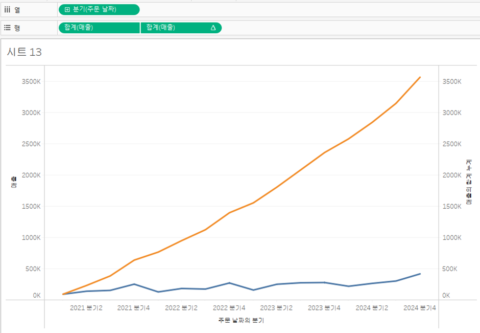

## 56. 대시보드 시트에 이동 동작

<!-- 대시보드 시트에 이동에 대해 알게 된 점을 적어주세요!-->

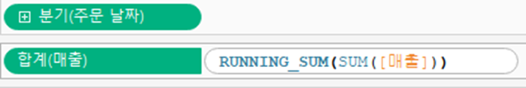

수익성 대시보드(메인 대시보드)에 연결할 새 대시보드 생성

수익성 대시보드-대시보드 탭-동작-동작 추가(드롭다운)-시트로 이동

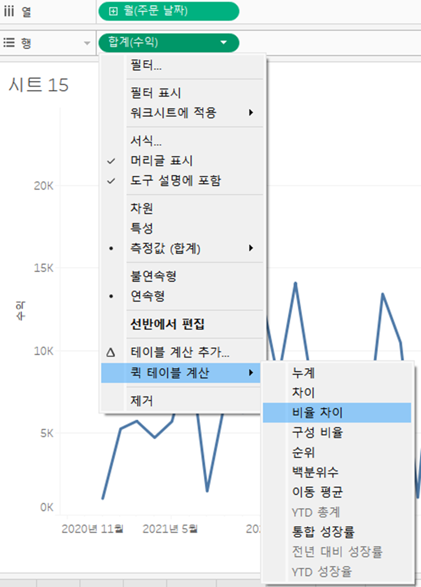

두 번째 대시보드로 이동하는 링크가 생성됨.

선택한 국가에 대한 데이터가 표시되도록 만드려면, 

대상 시트로 선택 후, 선택을 해제할 경우 '모든 값 표시'로 변경

다시 수익성 대시보드로 이동하는 단추를 생성하고자 함.

개체-탐색 드래그 앤 드롭, 개체 옵션-편집 단추

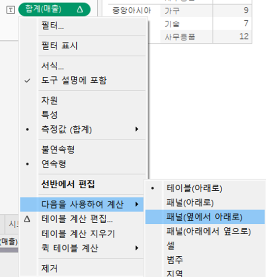

Alt+클릭 시 '수익성 대시보드'로 돌아감.

## 57. 매개변수 변경 동작

<!-- 매개변수 변경 동작에 대해 알게 된 점을 적어주세요!-->

## 문제

오늘은 별도의 문제가 없습니다. 

여러 대시보드를 참고하시어, superstore 데이터를 사용해 나만의 대시보드를 제작해주세요.

**단, 워크시트 3개 이상의 그래프를 표시해야 하며 각 시트 간 상호작용성 필터 or 하이라이트 동작은 꼭 추가되어야 합니다**

어떤 부분에 가중을 두었는지, 어떤 사용자 편의성을 고려하였는지에 대한 설명이 필요합니다.