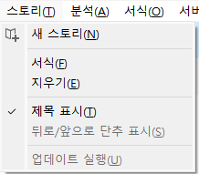
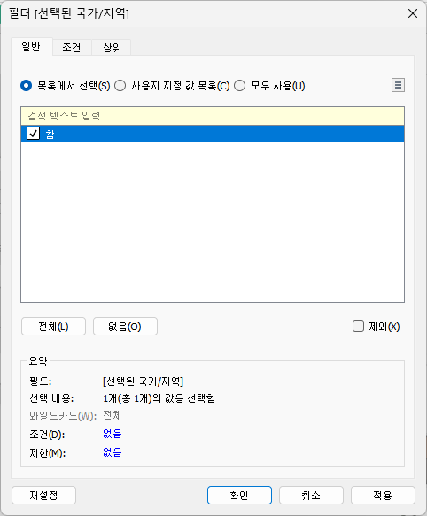

# 7th Study Week

## Study Schedule
<br>

| 회차 | 강의 범위   | 강의 이수 여부 | 링크                                                                                                     |
|------|-------------|----------------|--------------------------------------------------------------------------------------------------------|
| 1    | 1~7강       | ✅              | [링크](https://www.youtube.com/watch?v=AXkaUrJs-Ko&list=PL87tgIIryGsa5vdz6MsaOEF8PK-YqK3fz&index=84)    |
| 2    | 8~17강      | ✅              | [링크](https://www.youtube.com/watch?v=AXkaUrJs-Ko&list=PL87tgIIryGsa5vdz6MsaOEF8PK-YqK3fz&index=75)    |
| 3    | 18~27강     | ✅              | [링크](https://www.youtube.com/watch?v=AXkaUrJs-Ko&list=PL87tgIIryGsa5vdz6MsaOEF8PK-YqK3fz&index=65)    |
| 4    | 28~37강     | ✅              | [링크](https://www.youtube.com/watch?v=e6J0Ljd6h44&list=PL87tgIIryGsa5vdz6MsaOEF8PK-YqK3fz&index=55)    |
| 5    | 38~47강     | ✅              | [링크](https://www.youtube.com/watch?v=AXkaUrJs-Ko&list=PL87tgIIryGsa5vdz6MsaOEF8PK-YqK3fz&index=45)    |
| 6    | 48~57강     | ✅              | [링크](https://www.youtube.com/watch?v=AXkaUrJs-Ko&list=PL87tgIIryGsa5vdz6MsaOEF8PK-YqK3fz&index=35)    |
| 7    | 58~66강     | ✅             | [링크](https://www.youtube.com/watch?v=AXkaUrJs-Ko&list=PL87tgIIryGsa5vdz6MsaOEF8PK-YqK3fz&index=25)    |
| 8    | 67~77강     | 🍽️             | [링크](https://www.youtube.com/watch?v=AXkaUrJs-Ko&list=PL87tgIIryGsa5vdz6MsaOEF8PK-YqK3fz&index=15)    |
| 9    | 78~85강     | 🍽️             | [링크](https://www.youtube.com/watch?v=AXkaUrJs-Ko&list=PL87tgIIryGsa5vdz6MsaOEF8PK-YqK3fz&index=5)     |
---

<br/>

> **🧞‍♀️ 오늘은 강의보다 실습과 대시보드 직접 만들기가 더 중요하니, 기록보다는 사고하며 강의를 들어주세요.**

## 58. 집합값 변경

<!-- 집합값 변경 강의에서 알게 된 점을 적어주세요 -->
집합 값 변경 동작: 차트에서 요소를 클릭했을 때 요소의 하위 범주 및 관련 데이터 표시 가능  
: 만들어진 집합에 포함되는 필드를 변경함으로써 작동함.

실습에 앞서, 대시보드 제작에 필요한 제조업체 필드를 생성함. (제품이름의 첫 번째 단어가 제조업체라고 간주)
```
# 계산된 필드: '제조업체'
LEFT([제품 이름], FIND([제품 이름], " ") - 1)
```
제조 업체, 제품 필드 만들기
```
# 계산된 필드: '제조 업체'
IF [하위 범주 집합] THEN [제조업체]
ELSE '+'
END
```
```
# 계산된 필드: '제품'
IF [하위 범주 집합] AND [제조업체 집합] THEN [제품 이름]
ELSE '+'
END
```


'제조업체 집합' 필드, '제품 집합' 필드 생성  
(각각의 필드 우클릭 후 집합 만들기)  
-> 모두 선택 해제된 상태임을 확인


하위 범주 집합 변경.  
하위 범주를 선택하면 하위 범주 집합의 유일한 값으로 설정, 선택 취소시 해당 집합에서 모든 값이 제거됨.


제조 업체 집합 변경.  
제조 업체를 선택하면 제조 업체 집합의 유일한 값으로 설정, 선택 취소시 해당 집합에서 모든 값이 제거됨.


대시보드 시트 내 '+'를 클릭하면, 세부 필드명을 볼 수 있음.

메인 대시보드로 이동 후, 시트로 이동 동작 설정


하위 범주 그래프를 클릭하면, '제품에 대해 더 알아보기' 링크가 걸린 것을 확인 가능


## 59강. 스토리패널

<!-- 스토리패널 강의에서 알게 된 점을 적어주세요 -->


스토리 패널, 스토리 워크시트 페이지로 구성되어있음.

스토리 패널 하단에서 제목 표시 및 크기 변경 가능.



스토리 탭의 다양한 옵션.


스토리 툴 바: 변경된 내용 되돌리기, 스토리포인트에 대한 업데이트 적용, 삭제, 생성 가능

새 이름 저장(4번째 옵션) 기능으로 현재까지의 작업을 시작 지점으로 지정하여 작업을 진행할 수 있음.

예) 막대그래프 한 개 클릭->새 이름으로 저장: 선택한 내용이 저장된 상태로 새 스토리포인트에 복제되어 작업을 실시할 수 있음.


막대그래프 선택 후 스토리 포인트에 '호주의 매출 순위' 작성, 새 이름 저장 기능 클릭


그래프가 선택된 상태로 새로운 스토리포인트가 생성됨.


레이아웃 패널에서 다양한 탐색기 스타일 적용 가능.


## 60. 스토리

<!-- 알게 된 점을 적고, 아래 질문에 답해보세요 :) -->

스토리: 생성한 워크시트와 대시보드에 설명을 덧붙여 데이터를 설명하거나, 정보 전달, 의사 결정 지원, 설득력 있는 사례 구성 등의 기능을 구현하는 작업이 가능한 패널.


시트를 스토리포인트 옆으로 드래그 앤 드롭하면 새 스토리포인트+시트가 생성됨.


(기존에 만든 배송 대시보드 사용)  
빈 페이지 클릭, 대시보드 더블클릭해 스토리 포인트 생성


대시보드 내 특정 기간(2023.01~2024.12)을 선택하고, 스토리 포인트의 업데이트 기능 선택-현재까지의 작업 상태 저장.


대시보드 내 특정기간(2022.01~2022.12)를선택하고, 새 이름으로 저장->새로운 스토리 포인트 생성됨

=> 3번째, 4번째 스토리 포인트 확인: 
- [업데이트] 기능: 업데이트된 시점까지의 작업 상태를 나타냄
- [새 이름으로 저장] 기능: 생성된 시점의 작업 상태를 나타냄


대시보드 추가하여 추가적인 설명 진행.

스토리 기능을 이용하여, 스토리 포인트 간 플로우를 잘 구성하고, 자신만의 스토리텔링을 완성하여 내용을 분석하고 적절한 인사이트를 얻을 수 있음.


## 61. 대시보드 탐색

<!-- 대시보드 탐색 강의에서 알게 된 점을 적어주세요 -->
배송형태별 시트 생성 후 대시보드로 만듦

이미지 개체-막대그래프, 탐색 개체-나머지 그래프 이미지 삽입.


대시보드 복제 후, '라인 차트 대시보드' 만들기.
이미지 두 번째로 옮기고, 알맞게 이미지 변경.


편집 단추-이동할 위치에서 각 대시보드로 설정하여, 이미지를 선택하면 해당 대시보드로 이동하게 함.


## 62. 태블로 단추

<!-- 태블로 단추 강의에서 알게 된 점을 적어주세요 -->

표시/숨기기 단추를 만들고자 함.


먼저, 대시보드 상단에 각 시트의 이름을 작성함.


시트 옵션 확인-표시/숨기기 단추 추가하여, 텍스트 옆으로 이동


편집 단추는 텍스트, 이미지로 지정할 수 있음.


표시될 항목과 숨겨진 항목으로 나누어짐.


표시될 항목과 숨겨진 항목에 각각 스위치 이미지 삽입


Alt+클릭시 해당 시트 숨겨짐.


표시/숨기기 단추는 컨테이너 대상으로도 가능.


## 63. 막대그래프 드릴다운

<!-- 막대그래프 드릴다운에 대해 알게 된 점을 적어주세요 -->
드릴다운: 가장 요약된 레벨로부터 가장 상세한 레벨까지 차원의 계층에 따라 분석에 필요한 요약 수준을 바꿀 수 있는 기능.

드릴다운을 구현하기 위한 매개변수 생성


```
# 계산된 필드: 드릴다운 1
IF [배송 형태] = [매개 변수 Level 1] THEN [범주]
ELSE [배송 형태]
END
```


동작-매개 변수 변경.

배송 형태 막대그래프를 클릭하면, 범주로 드릴다운되는 것을 확인할 수 있음.


동일하게, 범주->하위범주로 드릴다운 되도록 설정


```
# 계산된 필드: 드릴다운 2
IF [드릴다운 1] = [매개 변수 Level 2] THEN [하위 범주]
ELSE ""
END
```


드릴다운이 2번에 걸쳐 진행됨.
```
# 계산된 필드: 드릴다운 1 레이블
IF [배송 형태] = [매개 변수 Level 1] THEN [범주]
ELSE ""
END
```
드릴다운을 실시할 때, 막대그래프의 행 레이블이 중복되지 않게 하고자 함.


드릴다운1 머리글 표시 해제,


행에 대한 필드 레이블 숨기기.


드릴다운을 실시하면 행 레이블이 중복되지 않음을 확인.


## 64. 트리맵 드릴다운

<!-- 트리맵 드릴다운에 대해 알게 된 점을 적어주세요 -->

드릴다운이 [Category] – [Sub-Category] – [Manufacturer] 순서로 이루어지는 트리맵을 생성하고자 함.


이번에는 집합을 이용해서 드릴다운을 만들 것임.

```
# 계산된 필드 만들기: 드릴다운 1-1
IF [범주 집합] THEN [하위 범주]
ELSE [범주]
END
```
동작-집합 값 변경


만든 드릴다운을 마크-레이블에 드래그 앤 드롭


트리맵을 클릭하면, 하위 범주로 나뉘게 됨.

동일하게, 하위 범주를 클릭하면 제조업체로 드릴다운이 되도록 만듦.

```
# 계산된 필드: 드릴다운 1-2
IF [드릴다운 1-1 집합] THEN [제조업체]
ELSE ""
END
```
동작-집합 값 변경


만든 드릴다운을 마크-레이블에 드래그 앤 드롭


두번에 걸쳐 드릴다운 가능(범주->하위 범주->제조업체)

```
# 계산된 필드: 드릴다운 1-1 레이블
IF [범주 집합] THEN [하위 범주]
ELSE ""
END
```
마크 선반 순서를 범주->드릴다운 1-1 레이블->드릴다운 1-2->드릴다운 1-1 순으로 배치.


드릴다운을 실시할 떄 트리맵 레이블이 중복되지 않으며, 각 구역을 유지하면서 드릴다운되는 것을 확인.

## 65. 파이 차트 드릴다운

<!-- 파이 차트 드릴다운에 대해 알게 된 점을 적어주세요 -->

범주->하위 범주 순서의 파이차트 만들기.

범주 집합 필드 생성


```
# 계산된 필드: 드릴다운 8-1
IF [범주 집합] THEN [하위 범주]
ELSE [범주]
END
```
계산된 필드 실행에 필요한 동작 생성: 동작-집합 값 변경.


마크 선반-크기의 매출 제거, 드릴다운 8-1 필드를 세부정보 마크에 추가.

드릴다운 8-1 유형을 색상으로 변경.


파이차트의 범주 클릭시 하위범주로 드릴다운됨을 확인.


행에 0 입력하고 Ctrl+드래그 앤 드롭으로 복사.

첫 번째 축의 마크카드에서 드릴다운 필드 제거, 크기 조정  
두 번째 축의 마크카드에서 크기 조정


축 우클릭-이중축, 우측 상단의 범주 범례에서 안쪽 색상과 통일.


안쪽 레이블은 드릴다운 했을 때만 표시하기 위해, 계산된 필드 생성
```
# 계산된 필드: 드릴다운 8-1 레이블
IF [범주 집합] THEN [하위 범주]
ELSE ""
END
```
서식 깔끔하게 변경: 행 구분선, 열 구분선, 격자선, 영 기준선 삭제, 머리글 표시 해제.


드릴다운을 실시할 때, 레이블 중복 없이 정렬된 상태로 색상별 구분.


## 66. 지도 드릴다운

<!-- 지도 드릴다운에 대해 알게 된 점을 적어주세요 -->

국가/지역 -> 시/도로 이어지는 지도 그래프를 생성하고자 함.

국가/지역 집합 필드 생성


```
# 계산된 필드: 드릴다운 9-1
IF [국가/지역 집합] THEN [시/도]
ELSE [국가/지역]
END
```
드릴다운 9-1을 지리적 역할-만들기 원본-시/도로 변경


동작-집합 값 변경


드릴다운 9-1을 마크-색상에 추가.

지도 그래프를 클릭하면, 드릴다운됨을 확인할 수 있음.


---
매개변수를 이용하여, 드릴다운+ 선택한 국가/지역만 필터링 되는 작업이 동시에 진행되는 방법 알아보기.

매개변수 생성, 'All' 값 입력


```
# 계산된 필드: 선택된 국가/지역
IF [매개 변수 국가/지역] = [국가/지역] THEN TRUE
ELSEIF [매개 변수 국가/지역] = "All" THEN TRUE
ELSE FALSE
END
```
매개 변수 표시 -> All로 설정


선택된 국가/지역 필드->필터 선반, 참 선택



동작-매개 변수 변경
(선택을 해제할 경우의 결과-다음 값으로 설정-All)


맵차트 내 특정 국가를 클릭하면, 선택한 도시만 확대해서 필터링됨+드릴다운 진행됨.


---

## 문제

오늘은 별도의 문제가 없습니다.

저번 주와 마찬가지로 여러 대시보드를 참고하시어, 학술제 주제 관련 데이터(없을 경우, 본인 관심 데이터)를 사용해 나만의 대시보드를 제작해주세요.

**단, 워크시트 3개 이상의 그래프를 표시해야 하며 각 시트 간 상호작용성 필터 or 하이라이트 동작은 꼭 추가되어야 합니다**

어떤 부분에 가중을 두었는지, 어떤 사용자 편의성을 고려하였는지에 대한 설명이 필요합니다.

