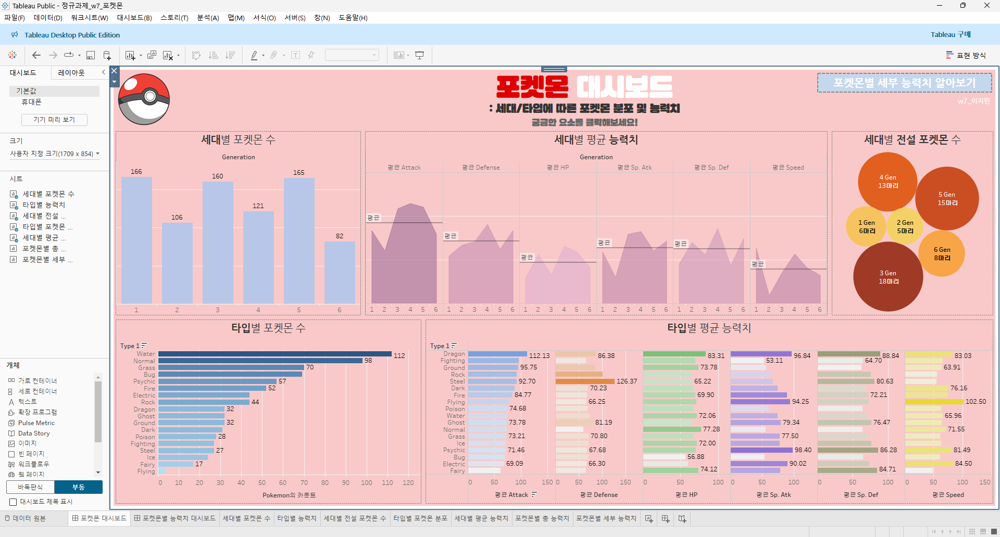
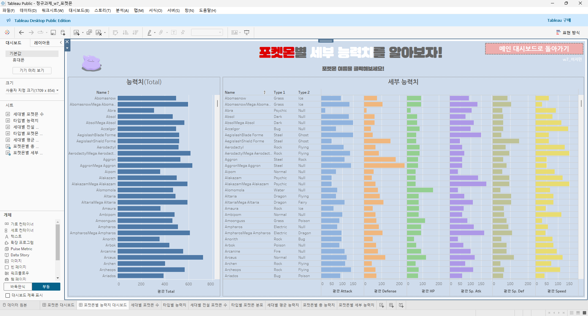
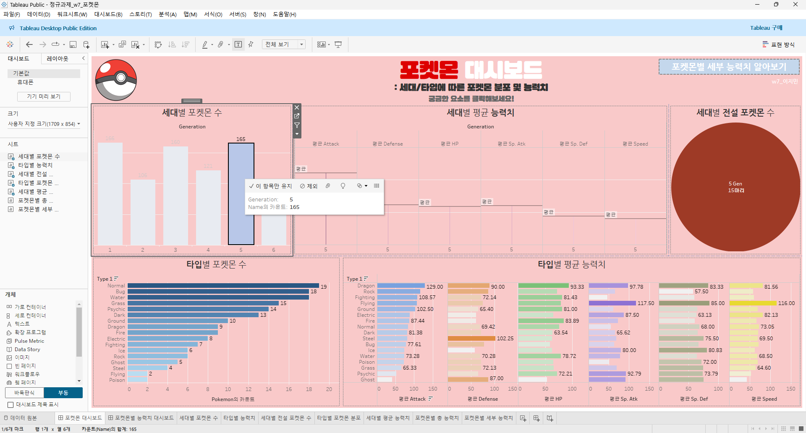
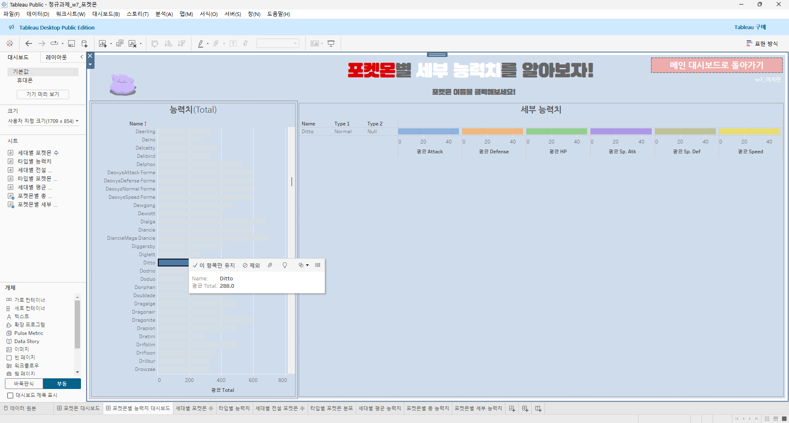

---

## 문제

여러 대시보드를 참고하시어, 학술제 주제 관련 데이터(없을 경우, 본인 관심 데이터)를 사용해 나만의 대시보드를 제작해주세요.

**단, 워크시트 3개 이상의 그래프를 표시해야 하며 각 시트 간 상호작용성 필터 or 하이라이트 동작은 꼭 추가되어야 합니다**

어떤 부분에 가중을 두었는지, 어떤 사용자 편의성을 고려하였는지에 대한 설명이 필요합니다.

https://public.tableau.com/views/_w7_/sheet0?:language=ko-KR&publish=yes&:sid=&:display_count=n&:origin=viz_share_link&:device=desktop 

포켓몬 데이터를 활용하였습니다.  

보고자 하는 세대, 타입, 포켓몬 이름 등 대시보드의 요소를 클릭하면, 대시보드 내 모든 시트에 동일하게 필터가 적용되어 나타납니다.

- ex1. 막대 그래프에서 5세대 선택->다른 모든 시트에서 5세대에 관한 정보가 나타남  

- ex2. 좌측 시트에서 메타몽의 이름을 클릭하면, 우측 시트에 이름, 타입, 세부 능력치 정보가 나타남  
